# Monitoring What Microsoft Doesn't Host

## Whole-service observability across Azure, AWS and on-premises: session companion

Kristopher Turner | CAS26 | October 2026

Most teams start a monitoring conversation with a tool or a site: "we need alerts for the datacenter" or "which agent goes on the AWS machines?" Both are reasonable questions, and both leave the real question unanswered: can customers use the service right now, and if not, what is affected, who acts and how do we know it recovered? When a service depends on components in Azure, in your own datacenter and in AWS at the same time, the answer has to follow the service, not the hosting boundary.

This companion is written for anyone who wants to understand the session, whether or not they were in the room. Each section has a diagram, a short explanation, an illustrative check of the idea and the decision you are left with, plus Microsoft Learn references. It is the *understand this* document. For the *do this* document - fillable worksheets paired with the copy-paste queries that verify them, and the one-page design checklist - see the companion [Observability Field Manual](observability-field-manual.md). A glossary is Appendix A, below.

### Five questions to take home

1. What does "working" mean for this service, in customer terms and with a time target?
2. Which evidence route carries each signal, and is that evidence fresh?
3. Can one query show which part of the service, in which cloud, failed or slowed down?
4. Does the service's health state follow its real dependencies, and does missing evidence show as Unknown?
5. Which telemetry answers a named question, and what does the rest cost?

### How to read the examples

Every example uses one application, IIC Hybrid Orders, described in section 3. The company, Infinite Improbability Corp, is fictional; the Azure, AWS and on-premises services it uses are real. Diagrams label each element **implemented** (built and verified in the presenter's lab), **designed** (specified, not yet deployed) or **conceptual** (a teaching picture). Commands and queries use placeholders in capitals, such as `YOUR_RG`; replace them with verified values. No output in this document is a result from your environment. Azure Monitor health models are in preview; check their current status before you rely on them.

<!-- pagebreak -->

## 1. Monitoring measures; observability explains

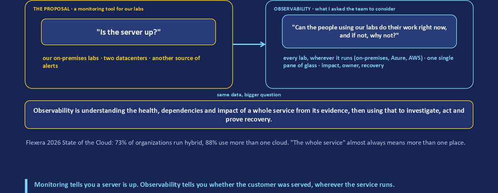

The two words are often used as synonyms. This session uses a working definition that separates them by what they produce. **Monitoring** collects and presents signals: metrics, logs, views, thresholds and alerts. It tells you that a number crossed a line. **Observability** explains and operates: it places the signal inside a service boundary, knows which dependency the signal belongs to, says which customer outcome is affected, names who owns the next action, and proves that the service recovered afterwards. Signals plus context turn a measurement into a decision.

The session grew out of a real team meeting. The presenter's team runs its lab environments, some of them treated as production. A corporate monitoring solution is shared with lab environments that other teams manage, so the team is flooded with alerts for systems it does not own. Someone proposed another monitoring tool just for the team's own labs, and the thinking stayed on-premises, across two datacenters. That exposes the two gaps most monitoring discussions have. The **alert-only** gap assumes that enough well-tuned alerts add up to understanding; they do not, and a second tool is a second flood unless every alert carries an owner. The **site-first** gap designs monitoring one location at a time, so the datacenter team, the Azure team and the AWS team each have a green view while the service that crosses all three is failing. The presenter's answer was observability: start from the whole service and bring the labs that extend into Azure and AWS into one single pane of glass from the start. The example used throughout, IIC Hybrid Orders, is a fictional service that lets every part of observability be shown on one chain across three places.

| Question | Monitoring answers | Observability also answers |
|---|---|---|
| Is something wrong? | A threshold was crossed on a resource | Which customer outcome is affected, and since when |
| Where? | On this host or resource | In which dependency, in which cloud, and what depends on it |
| What next? | Someone was notified | Who owns it, what bounded action is allowed, what proves recovery |
| Can we trust the view? | Assumed | Evidence is fresh, and missing evidence shows as Unknown |

**Verify in your tenant.** List what a service is made of before you monitor it. If your resources carry a service tag, Azure Resource Graph can show the service across Azure and Arc-enabled resources in one result:

```kusto
Resources
| where tags['Service'] =~ 'YOUR_SERVICE_NAME'
| summarize Resources=count() by type, location
| order by Resources desc
```

*Expect* Azure resource types and, for machines and clusters outside Azure, `microsoft.hybridcompute/machines` and `microsoft.kubernetes/connectedclusters`. A dependency you know exists but cannot find here is invisible to every view built on this scope.

**Decision you make:** where the service boundary is, and which components inside it belong to the customer outcome.

References: [Azure Monitor overview](https://learn.microsoft.com/en-us/azure/azure-monitor/fundamentals/overview), [Health modeling with Azure Monitor health models](https://learn.microsoft.com/en-us/azure/azure-monitor/health-models/health-modeling).

## 2. Define what "working" means before collecting anything

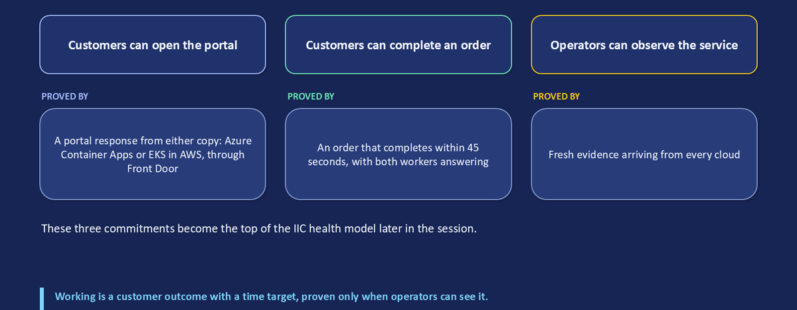

Success is a customer outcome with a time target, not a green server. Write it down before you choose agents, tables or dashboards, because every later decision traces back to it. A useful definition names the customer action, the expected result, the time target, the dependencies the action needs and the evidence that proves it happened.

IIC Hybrid Orders has three commitments:

| Commitment | Evidence that proves it |
|---|---|
| Customers can open the portal | A portal response from either of its two origins |
| Customers can complete an order | An order that completes inside the time target, with every required stage present |
| Operators can observe the service | Fresh evidence arriving in the workspaces the operators read |

The third commitment is easy to forget. If the evidence stops arriving, the service may still be working, but nobody can say so. That is a different problem from an outage and needs a different owner and response.

These commitments become the top of the health model in section 8. Every signal, alert and runbook in the rest of this document should answer to one of them. Use the "define working" worksheet in the Field Manual for your own service.

**Verify in your tenant.** If a component is instrumented with Application Insights (workspace-based), you can read the customer-facing result of one operation directly:

```kusto
AppRequests
| where TimeGenerated > ago(1h)
| where Name == 'YOUR_OPERATION_NAME'
| summarize Requests=count(), Succeeded=countif(Success == true),
    P95Ms=percentile(DurationMs, 95), LastSeen=max(TimeGenerated)
| extend SuccessPercent=iff(Requests > 0, 100.0*Succeeded/Requests, real(null))
```

*Read it as* success and speed for that one component's requests. It is a strong input to "customers can complete an order", but not the whole answer when the order also depends on work done elsewhere. Zero requests is insufficient evidence, not 100% success.

**Decision you make:** the customer action, the time target and the minimum number of observations you need before you call the service Healthy.

References: [Health modeling (customer commitments)](https://learn.microsoft.com/en-us/azure/azure-monitor/health-models/health-modeling), [Application Insights overview](https://learn.microsoft.com/en-us/azure/azure-monitor/app/app-insights-overview).

## 3. One service across three clouds

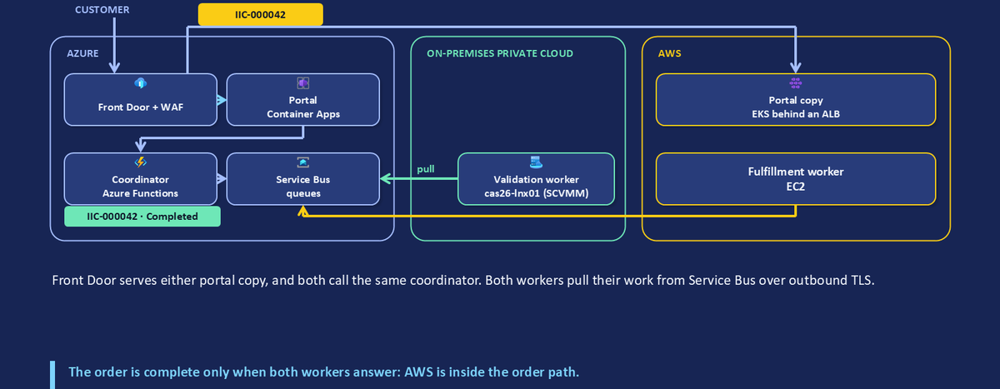

IIC Hybrid Orders is one application whose customer outcome depends on Azure, AWS and an on-premises private cloud at the same time.

1. A customer opens the portal through **Azure Front Door** with a web application firewall. Front Door serves the portal from either of two origins: **Azure Container Apps**, or **Amazon EKS** behind an Application Load Balancer.
2. An order coordinator on **Azure Functions** accepts the order and gives it a correlation ID.
3. The coordinator puts work on **Azure Service Bus** queues.
4. A **validation worker** on a Linux VM in the on-premises private cloud (SCVMM-managed Hyper-V) pulls its work over an outbound connection and validates the order.
5. A **fulfillment worker** on **Amazon EC2** pulls its work and prices and fulfills the order.
6. Both results return through Service Bus. The order is complete only when both workers answer inside the time target.

AWS is inside the order path, not beside it. A fault in the AWS worker fails the order even when every machine is running. That is why the view has to include all three places.

Read dependencies forward and impact backward. Forward: customer, portal, coordinator, then both workers. Backward: when the AWS worker fails, fulfillment fails, so orders fail, so customers cannot complete an order. Infrastructure state alone cannot answer "who cannot complete what, and what evidence proves it?"

A service map is not proof of coverage. The map shows intended scope. Coverage means each box has evidence that exists, is fresh, is correlated with the others and has an owner. Sections 4 to 6 earn coverage one route at a time.

**Verify in your tenant.** List the machines and clusters outside Azure that your service depends on, with their connection state:

```kusto
Resources
| where type in~ ('microsoft.hybridcompute/machines',
    'microsoft.kubernetes/connectedclusters')
| where resourceGroup in~ ('YOUR_ONPREM_RG', 'YOUR_AWS_RG')
| project name, type, resourceGroup,
    ServerStatus=tostring(properties.status),
    ClusterStatus=tostring(properties.connectivityStatus)
```

*Expect* every component outside Azure to appear. `Connected` proves the management path, not collection and not the application.

**Decision you make:** which dependencies are required for the customer outcome and which are redundant, because that decides how health rolls up later.

References: [Azure Arc-enabled servers](https://learn.microsoft.com/en-us/azure/azure-arc/servers/overview), [Multicloud connector enabled by Azure Arc](https://learn.microsoft.com/en-us/azure/azure-arc/multicloud-connector/overview), [Azure Front Door origins](https://learn.microsoft.com/en-us/azure/frontdoor/origin).

## 4. Evidence routes: agent collection and direct ingestion

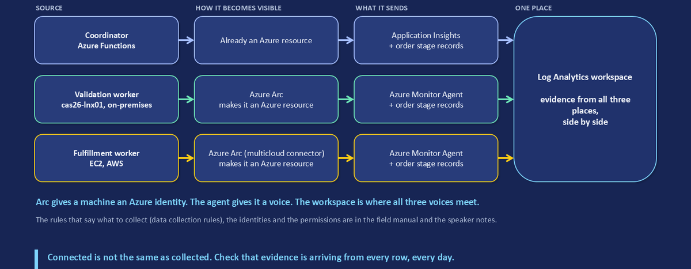

Arc management and workload evidence travel on different paths. The **management plane** is the Azure resource, its identity, Policy, extensions and RBAC. The **evidence plane** is data that a collector or an application sends to a workspace. Registering a machine with Arc is not collection, and neither path carries the order itself.

Every evidence route names five things: a **source**, a **collector**, a **rule**, an **identity** and a **destination**. For IIC Hybrid Orders:

| Route | Source and collector | Rule | Destination |
|---|---|---|---|
| Azure coordinator | Functions with Application Insights; stage records sent by the code | Direct DCR for the stage records | Log Analytics |
| On-premises worker | Arc-enabled server with Azure Monitor Agent (AMA) | DCR plus association (DCRA) | Log Analytics: Heartbeat, Perf, Syslog |
| AWS worker | Arc-enabled server (onboarded by the multicloud connector) with AMA | DCR plus association | Log Analytics: the same tables |
| Both workers, stage records | The worker code | Direct DCR | Log Analytics |

Because the AWS worker is Arc-enabled, its guest evidence arrives the same way as the on-premises worker's. Nothing about the route depends on which cloud hosts the machine.

### A DCR is a collection contract; agent routes also need an association

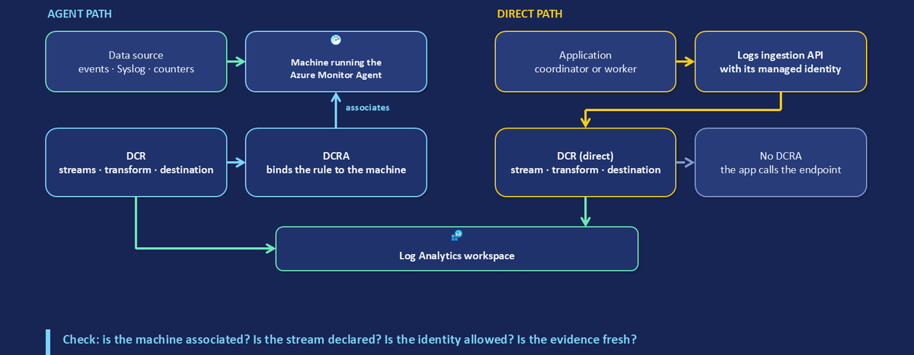

A **data collection rule (DCR)** declares the input streams, an optional transformation and the destination. On the agent path, a **data collection rule association (DCRA)** binds the rule to a machine; without it AMA collects nothing you chose. On the direct path, the application calls the Logs Ingestion API at the DCR's own logs ingestion endpoint (a DCR created with `"kind": "Direct"`) or at a data collection endpoint when you use private link. There is no association: access is controlled by the sender's identity and a role on the DCR. Both paths still need the stream, the schema and the destination table to agree, or records are rejected.

**Verify in your tenant.** Check the agent path for one machine, then the direct path for one rule:

```powershell
az monitor data-collection rule association list `
  --resource YOUR_ARC_MACHINE_RESOURCE_ID -o table

az monitor data-collection rule show -g YOUR_RG -n YOUR_DIRECT_DCR `
  --query "{kind:kind, endpoint:endpoints.logsIngestion, streams:keys(streamDeclarations)}"
```

*Expect* at least one association that names your DCR, and for the direct rule a `Direct` kind with a logs ingestion endpoint. *Troubleshooting order:* association present; data source and stream correct; destination table exists with matching columns; sender has the role on the DCR; network path open; records arrive (Appendix A.3).

**Decision you make:** which evidence arrives by agent, which by direct ingestion, and one owner per route.

References: [Data collection rules](https://learn.microsoft.com/en-us/azure/azure-monitor/data-collection/data-collection-rule-overview), [Azure Monitor Agent](https://learn.microsoft.com/en-us/azure/azure-monitor/agents/azure-monitor-agent-overview), [Logs Ingestion API](https://learn.microsoft.com/en-us/azure/azure-monitor/logs/logs-ingestion-api-overview).

## 5. Evidence routes fail at identity and connectivity boundaries


Three different identities act on one evidence route, and a failure at any of them looks the same from the dashboard: no data.

- **Machine identity.** The Arc-enabled server's system-assigned managed identity. It represents the machine in Azure for management and extensions such as AMA.
- **Ingestion identity.** The identity that sends records to the Logs Ingestion API: the Function's managed identity, or the worker's Arc managed identity used by the worker code (on Linux, the account that runs the worker must be in the local `himds` group to request a token). It needs the **Monitoring Metrics Publisher** role (or a custom role with the `Microsoft.Insights/Telemetry/Write` data action) on the DCR. Role assignments can take up to 30 minutes to take effect; before then the API returns 403.
- **Reader identity.** The operator, the workbook viewer or the health model's own managed identity, which needs read access to the workspace. The health model evaluates signals with its identity, not yours, so a query that works for you can fail for the model.

A management identity is not automatically an ingestion identity, and neither is automatically a reader. Name the actor for every operation.

Connectivity is the other boundary. Check DNS resolution and outbound HTTPS (443) to the ingestion endpoint, private link where you use it, TLS 1.2 or higher (the Logs Ingestion API enforces it), and that no shared key is used where an identity should be.

**Verify in your tenant.** List who can send to a direct DCR:

```powershell
az role assignment list --scope YOUR_DIRECT_DCR_RESOURCE_ID `
  --include-inherited -o table
```

*Expect* Monitoring Metrics Publisher for each sender's principal and nothing broader than you intend. A sender missing from this list explains a 403 on ingestion; a broad inherited role explains why a sender you did not plan for can write.

**Decision you make:** for each route, which identity sends, which reads, and who approves a change to either.

References: [Logs Ingestion API permissions](https://learn.microsoft.com/en-us/azure/azure-monitor/logs/tutorial-logs-ingestion-portal), [Authenticate against Azure resources with Arc-enabled servers](https://learn.microsoft.com/en-us/azure/azure-arc/servers/managed-identity-authentication), [Health model signals and authentication](https://learn.microsoft.com/en-us/azure/azure-monitor/health-models/signals).

## 6. Correlation: follow one order through three clouds

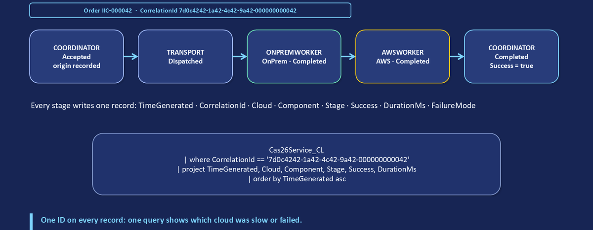

Different evidence answers different questions:

| Evidence | Answers | Does not answer |
|---|---|---|
| Metrics | How much, how fast | Which order was affected |
| Logs and events | What happened, where | Whether the customer outcome completed |
| Heartbeat | The agent contacted Azure recently | Anything about the application |
| Stage records | Which order, which stage, which cloud, how long | Why a stage failed, on their own |
| Health state | What your rules conclude from their signals | More than those signals and rules allow |

What joins them is **correlation context**: resource IDs, timestamps, known dependency direction and, for the application, one **correlation ID** per order. In IIC Hybrid Orders the coordinator assigns a GUID `CorrelationId` when it accepts the order, and every stage in every cloud writes one record carrying it, with the cloud, component, stage, result and duration. The customer-visible order number (for example `IIC-000042`) is for display only and is never the join key.

One query can then show exactly which cloud was slow or failed for that order. This is correlation by a shared business key, not a distributed trace: there is no span tree, no parent-child timing and no automatic propagation. It narrows an investigation quickly; it does not prove cause on its own. Application Insights provides distributed tracing for components it instruments; the workers here pull from a queue and write their own records, so the shared ID is the thread that ties them together.

**Verify in your tenant.** *Prerequisite:* your application writes one record per stage to a custom table with at least `TimeGenerated`, `CorrelationId`, `Cloud`, `Component`, `Stage`, `Success` (boolean) and `DurationMs` (long). The IIC schema is used here; map your own names first.

```kusto
YOUR_STAGE_TABLE_CL
| where TimeGenerated > ago(24h)
| where CorrelationId == 'YOUR_CORRELATION_ID'
| project TimeGenerated, Cloud, Component, Stage, Success, DurationMs
| order by TimeGenerated asc
```

*Read it* top to bottom as the order's journey. A `Success == false` row names the failing stage and cloud. A missing stage (for example no AWS row at all) means the work never started, is still waiting or its evidence route is broken: check freshness (Field Manual, "investigation and freshness") before you conclude anything.

**Decision you make:** the fields every stage must write, and who owns the schema when it changes.

References: [Create a custom table](https://learn.microsoft.com/en-us/azure/azure-monitor/logs/create-custom-table), [Telemetry correlation in Application Insights](https://learn.microsoft.com/en-us/azure/azure-monitor/app/distributed-tracing-telemetry-correlation).

## 7. The service view and a disciplined investigation

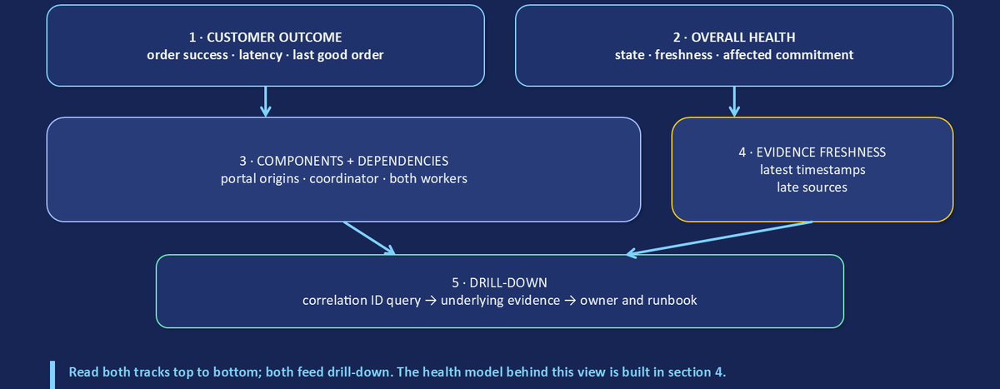

A service view answers operator questions in a fixed reading order. Each panel earns its place only if it supports a decision.

1. **Customer outcome.** Order success, latency and the time of the last good order.
2. **Overall health.** The model's state, its freshness and which commitment is affected.
3. **Components and dependencies.** Both portal origins, the coordinator and both workers.
4. **Evidence freshness.** The latest timestamp per source, and which sources are late.
5. **Drill-down.** From a correlation ID query, to the model signal that changed, to the owner and runbook.

An Azure Monitor workbook is a good home for this: it can query Log Analytics, Azure Resource Graph and metrics in one page, with parameters such as the time range and a correlation ID. The workbook visualizes; it does not calculate the model's state. Keep the health model as the single source of state and link to it.

A one-resource view can be green while the service question stays unanswered. The on-premises worker's CPU and heartbeat may look fine, but that view cannot say whether orders completed, which origin served them or whether AWS fulfillment is answering.

**Investigate from customer impact toward narrower evidence**, in five steps:

1. **Confirm impact:** which operation, since when, how many orders.
2. **Scope the order:** one correlation ID and the resources it touched.
3. **Compare stages:** coordinator, on-premises and AWS records for that order.
4. **Inspect dependencies:** the model's state and the freshness of each source.
5. **Decide:** the owner and a bounded action.

Call something a cause only when a test and the evidence support it; stop when the evidence no longer supports the next claim.

**Verify in your tenant.** Check freshness per source before trusting any panel (the Field Manual's "investigation and freshness" section extends this to stage records):

```kusto
Heartbeat
| where TimeGenerated > ago(1h)
| summarize LastSeen=max(TimeGenerated) by Computer, _ResourceId
| extend EvidenceAge=now()-LastSeen
| order by EvidenceAge desc
```

*Read it* against the expected cadence: AMA sends a heartbeat about once a minute, so an age of several minutes is a late source. A machine missing from the list is not proven down; its route may be broken.

**Decision you make:** the panels, their order and the drill-down path, and who maintains the view.

References: [Azure Workbooks](https://learn.microsoft.com/en-us/azure/azure-monitor/visualize/workbooks-overview), [Log data ingestion time](https://learn.microsoft.com/en-us/azure/azure-monitor/logs/data-ingestion-time).

## 8. Health models: from the SCOM idea to a working model

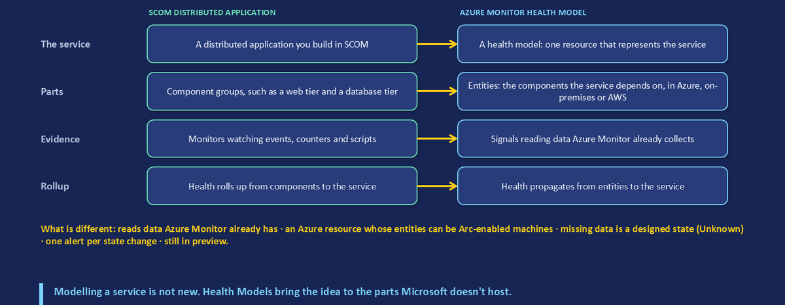

The investigation produces evidence; the model produces a state. Keep them separate: evidence (stage results, logs, metrics, freshness) goes into signal evaluation (a query, a time range, thresholds), which produces a state for an entity, which propagates toward the service.

### The idea is not new

If you ran System Center Operations Manager (SCOM), you already modelled services: a **distributed application** grouped components, **monitors** set their health, and **rollup** carried health to the application. Azure Monitor health models (preview) apply the same idea to Azure, Arc-enabled and logical components: a **health model** resource contains **entities**, **signals** attach evidence to them, and **relationships** propagate health. What carries over is the operating idea: model the service, then let component health explain it. What does not carry over is the product: there are no management packs, discovery works from Azure Resource Graph, Application Insights or service groups, and signals read data that Azure Monitor already collects. Health models do not collect telemetry themselves.

### Five terms

| Term | Meaning |
|---|---|
| Entity | A component of the workload. The **root** entity is the model itself; an **Azure resource** entity represents a resource; a **generic** entity represents a logical component, a journey or an aggregation. |
| Relationship | A parent depends on, or aggregates, a child. An entity can have several parents and several children. |
| Signal | A metric, Log Analytics (KQL) query, Azure Monitor workspace (PromQL) query, Azure Resource Health status or external report, compared with a Degraded and an Unhealthy threshold. |
| Evaluation | Each signal is refreshed on its interval; an entity takes the **worst** state of its signals and its propagated children. |
| Propagation | How a child's state reaches its parent, controlled by the child's **impact** and the parent's **dependencies** settings. |

### Entities and relationships encode the service graph

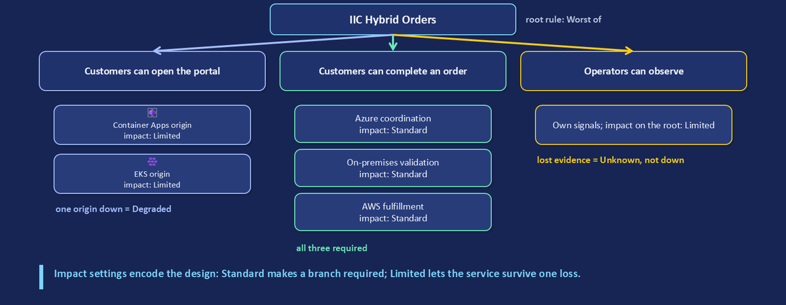

Build the model commitment-first. The root is IIC Hybrid Orders; under it sit the three commitments from section 2. "Customers can complete an order" has three required children: Azure request coordination, on-premises validation and AWS fulfillment. "Customers can open the portal" depends on global entry (Front Door, WAF, DNS) and on a generic entity for the two portal origins, which are a redundant pair. "Operators can observe the service" depends on Log Analytics ingestion and the Azure Monitor workspace. Development entities may appear in the workbook but should not roll up into the production commitment. Model only dependencies that affect the parent outcome.

**Verify in your tenant.** With the preview `health-models` CLI extension (`az extension add --name health-models`), read one entity's signals and their current states:

```powershell
az monitor health-models entity show -g YOUR_RG `
  --health-model-name YOUR_MODEL -n YOUR_ENTITY `
  --query "properties.signalGroups.*.signals[].{signal:name, state:status.healthState, value:status.value}" `
  -o table
```

*Expect* every entity that shows a colour to have at least one named signal or child. A coloured entity with no signal and no child cannot explain itself.

References: [Health models overview](https://learn.microsoft.com/en-us/azure/azure-monitor/health-models/overview), [Health model concepts](https://learn.microsoft.com/en-us/azure/azure-monitor/health-models/concepts), [Health models CLI](https://learn.microsoft.com/en-us/azure/azure-monitor/health-models/cli), [SCOM distributed applications](https://learn.microsoft.com/en-us/system-center/scom/manage-using-authoring-workspace?view=sc-om-2025), [SCOM key concepts](https://learn.microsoft.com/en-us/system-center/scom/key-concepts?view=sc-om-2025).

### A signal attaches evidence, a window and a rule to an entity

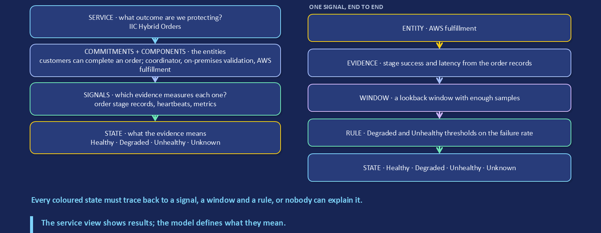

Without these details a coloured state cannot be explained. A Log Analytics signal runs a query against one workspace on a **refresh interval**, over a **query time range**, and must return a single record with a numeric value; if it returns several records, only the first is used. The value is compared with an optional **Degraded** threshold and a required **Unhealthy** threshold. Queries can use template strings such as `{{entity.azureResourceId}}` so one signal definition serves many entities. For each signal, also record its evidence contract: scope, timestamp field, expected cadence, missing-data behaviour and owner.

A signal for AWS fulfillment, as a failure percentage over 15 minutes (schema prerequisite as in section 6):

```kusto
YOUR_STAGE_TABLE_CL
| where TimeGenerated > ago(15m)
| where Component == 'AwsWorker' and Stage in ('Completed', 'Failed', 'TimedOut')
| summarize Total=count(), Failed=countif(Success == false)
| project value=iff(Total == 0, real(null), 100.0*Failed/Total)
```

With, for example, Degraded above 2 and Unhealthy above 10, a burst of failures turns the entity Unhealthy. Pair it with a heartbeat signal so a silent worker is not mistaken for a healthy one.

### Propagation: required versus redundant dependencies

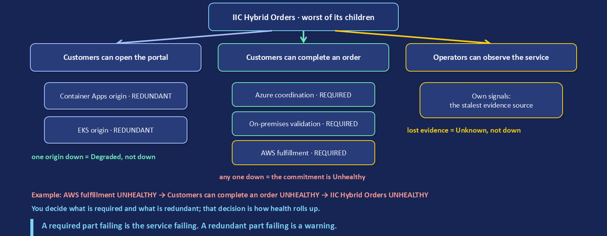

Evaluation sets a signal state; aggregation combines child states. By default a child uses **Standard** impact (its state propagates unchanged) and a parent uses **Worst of** (it takes the worst child state). That is right for required dependencies: when the AWS worker is Unhealthy, AWS fulfillment is Unhealthy, so "Customers can complete an order" is Unhealthy.

It is wrong for a redundant pair. For the two portal origins, set the generic "portal origins" entity's dependencies to **Not-healthy limit** (the rollup tutorial's portal screens call it Maximum not healthy): Degraded at 1 not-healthy child, Unhealthy at 2. One failed origin then makes the portal Degraded; both make it Unhealthy. A child with **Limited** impact never passes Unhealthy upward (only as Degraded); **Suppressed** passes nothing. The settings, not the colour of the child, decide the parent's state. Degraded does not count as downtime for a health objective; Unhealthy does.

### Missing or stale evidence must remain visible

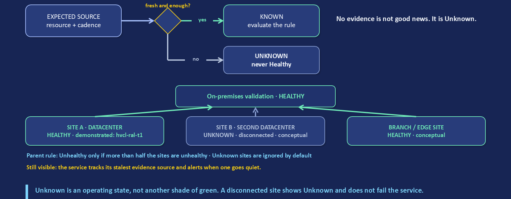

**Unknown** means insufficient data or a lack of signals prevents determining the state. It is an operating state, not another shade of green. Decide what each signal returns when no records arrive, then test it: stop a test source and watch what the entity shows. A disconnected site can keep working while its central evidence ages; name the local owner and the last trustworthy observation. In IIC, missing ingestion makes "Operators can observe the service" Unknown and raises its own alert; it does not claim the application is down. When a group uses Healthy limit or Not-healthy limit, the **Ignore unknown** option (on by default) excludes Unknown signals from the count; know which way yours is set.

**Verify in your tenant.** Read the state transitions of one entity to see what changed and when:

```powershell
az monitor health-models entity get-history -g YOUR_RG `
  --health-model-name YOUR_MODEL --entity-name YOUR_ENTITY `
  --query "history[].{at:occurredAt, from:previousState, to:newState}" -o table
```

**Decision you make:** for each relationship, whether the child is required, redundant or informational; for each signal, the window, thresholds and missing-data behaviour. Use the "health model design" worksheet in the Field Manual.

References: [Health propagation settings](https://learn.microsoft.com/en-us/azure/azure-monitor/health-models/concepts#health-propagation-settings), [Signals](https://learn.microsoft.com/en-us/azure/azure-monitor/health-models/signals), [Configure health rollup](https://learn.microsoft.com/en-us/azure/azure-monitor/health-models/rollup), [Analyze health](https://learn.microsoft.com/en-us/azure/azure-monitor/health-models/analyze-health).

## 9. Alerts, the four clocks and proof of recovery

An alert is useful when it carries context to an accountable owner. A good alert contract has four parts: a **condition** that matters (a commitment or signal state, not every threshold), **context** (service, component, evidence, freshness, a correlation ID where one exists), an **owner** (team, permission, runbook) and a **verified outcome**. Health model alerts fire when an entity changes to Degraded or Unhealthy, only where you enable them, use the same action groups as other Azure Monitor alerts, and resolve when the entity returns to Healthy. One alert on a commitment replaces many signal alerts for the responder, while component owners can keep their own. A configured rule is not proof that a notification was delivered: test the action group.

### One incident has four clocks

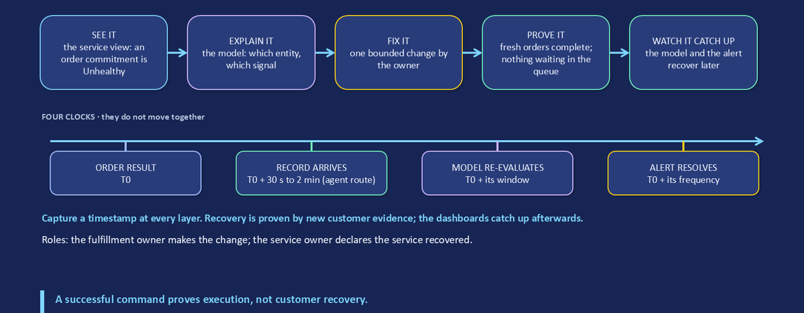

Surfaces do not change together. Capture the timestamp at each layer. The ranges below are documented typical values, not guarantees:

| Clock | Starts when | Typical delay (Microsoft Learn) |
|---|---|---|
| Request | The order result is written (T0) | None; this is the reference |
| Ingestion | The record is queryable | AMA uploads every 30 seconds to 2 minutes, then under 10 seconds of processing; Azure resource logs 3 to 10 minutes; activity logs 3 to 20 minutes |
| Model evaluation | A signal's next refresh reads it | Up to one refresh interval (commonly 1 minute) plus the query time range you chose |
| Alert | The rule's next evaluation fires | Metric alerts as often as every minute; log search alerts every 1 minute to 24 hours |

Recovery proof repeats the clocks. A stateful log search alert on a 1-minute frequency resolves only after its condition has not been met for 10 minutes, so the alert can stay open well after customers recovered.

### Act within a boundary, then verify the service

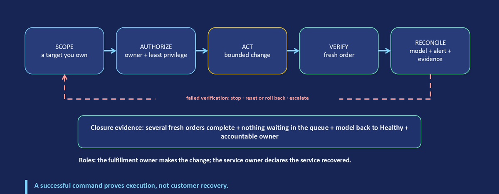

Scope the change to a target you own; authorize it with least privilege; make one bounded change; verify with a **fresh** order; then reconcile the model, the alert and the evidence. If verification fails: stop, reset or roll back, escalate. A successful command proves execution, not customer recovery. In the session's controlled fault, the AWS worker failed tagged test orders only; recovery was a new order with a new correlation ID that completed, followed later by the model and then the alert.

**Verify in your tenant.** Measure the ingestion clock for your own agents:

```kusto
Heartbeat
| where TimeGenerated > ago(8h)
| extend E2ELatency=ingestion_time() - TimeGenerated
| summarize percentiles(E2ELatency, 50, 95) by Computer
| top 20 by percentile_E2ELatency_95 desc
```

*Read it* as the delay before any view or rule can see a machine's data. Set alert windows and your recovery wait to be longer than the 95th percentile.

**Decision you make:** which commitments alert, who receives each, and what fresh evidence closes the incident.

References: [Health model alerts](https://learn.microsoft.com/en-us/azure/azure-monitor/health-models/alerts), [Action groups](https://learn.microsoft.com/en-us/azure/azure-monitor/alerts/action-groups), [Log data ingestion time](https://learn.microsoft.com/en-us/azure/azure-monitor/logs/data-ingestion-time), [Create a log search alert rule](https://learn.microsoft.com/en-us/azure/azure-monitor/alerts/alerts-create-log-alert-rule), [Types of alerts](https://learn.microsoft.com/en-us/azure/azure-monitor/alerts/alerts-types).

## 10. Cost: name the question, then the meter

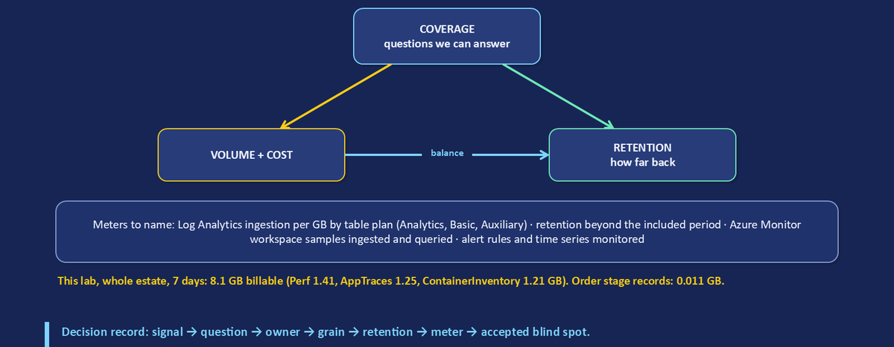

Reduce telemetry only after naming the diagnostic question it answers. Start with the question, then choose the grain, the retention and the destination. Know which meter each choice moves:

| Meter | What drives it |
|---|---|
| Log Analytics ingestion | GB ingested per table, priced by **table plan**: Analytics (full features, an analytics retention period included), Basic (reduced ingestion price, queries billed per GB scanned) or Auxiliary (lowest ingestion price, slower queries, no alerts) |
| Log Analytics retention | Analytics retention beyond the included period, and long-term retention, per GB per month |
| Azure Monitor workspace | Prometheus-compatible samples ingested and samples processed by queries |
| Alerts | Rules and the time series or evaluations they monitor |

Check current prices before quoting money. Changing a table's plan changes what you can do with it: Auxiliary tables do not support alerts, and a table can switch plan only once a week.

**Duplicate collection multiplies cost and confusion.** The same CPU counter or application log collected by two routes (AMA with a DCR and a legacy or second agent, or two DCRs that overlap) produces duplicated records, charts, alert rules and incidents. The legacy Log Analytics agent was retired in August 2024; if any machine still reports through it alongside AMA, you are paying twice. Inventory routes before adding another agent, and remove duplication only after checking which questions each route answers.

A decision record keeps reductions honest:

| Signal | Question it answers | Owner | Grain | Retention | Meter | Accepted blind spot |
|---|---|---|---|---|---|---|
| | | | | | | |

**Verify in your tenant.** Find machines reporting through more than one agent type:

```kusto
Heartbeat
| where TimeGenerated > ago(1h)
| summarize AgentTypes=dcount(Category), Categories=make_set(Category) by Computer
| where AgentTypes > 1
```

*Expect* no rows. A row showing both `Azure Monitor Agent` and `Direct Agent` is a duplicate route to remove. Then run the billable-volume query in the Field Manual's "cost" section to see which tables drive ingestion.

**Decision you make:** for each high-volume table, its question, owner, plan and retention, and the blind spot you accept when you reduce it.

References: [Azure Monitor Logs cost calculations](https://learn.microsoft.com/en-us/azure/azure-monitor/logs/cost-logs), [Table plans](https://learn.microsoft.com/en-us/azure/azure-monitor/logs/logs-table-plans), [Azure Monitor pricing](https://azure.microsoft.com/en-us/pricing/details/monitor/), [Migrate to Azure Monitor Agent](https://learn.microsoft.com/en-us/azure/azure-monitor/agents/azure-monitor-agent-migration).

## 11. Keep the view useful: the operating cycle

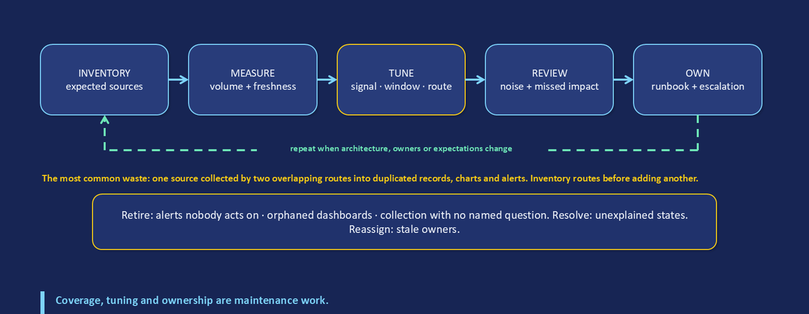

Coverage, tuning and ownership are maintenance work, not a project that ends. Run the cycle on a schedule and whenever the architecture, the owners or the expectations change:

1. **Inventory** the expected sources for each commitment.
2. **Measure** their volume and freshness.
3. **Tune** signals, windows, thresholds and routes.
4. **Review** alert noise and any impact the view missed.
5. **Own** runbooks and escalation, and retire what no longer answers a question: unused tables, duplicate routes, alerts nobody acts on and panels nobody reads.

### Take-home evidence review

- [ ] Customer action, expected result, time target, owner and service boundary are written down.
- [ ] Required, redundant and informational dependencies are separated.
- [ ] Each signal has a source, route, identity, time window, freshness expectation and destination.
- [ ] Correlation context is explicit; an identifier is not called tracing unless the implementation provides traces.
- [ ] Missing or stale evidence shows as Unknown or a coverage gap, never as Healthy.
- [ ] Each alert has a condition that matters, context, an owner and a tested notification.
- [ ] A bounded action has an owner, an authority boundary, a reset and a fallback.
- [ ] Recovery is proven with a fresh customer result, after all four clocks have caught up.
- [ ] Retained telemetry is tied to a diagnostic question and reviewed against its meter.

<!-- pagebreak -->

## Appendix A. Glossary

| Term | Meaning |
|---|---|
| Commitment | A customer outcome with a time target that the service promises, such as "customers can complete an order" |
| Arc-enabled server | A machine outside Azure running the Connected Machine agent, represented as `Microsoft.HybridCompute/machines` |
| AMA | Azure Monitor Agent, the collector on a machine |
| DCR / DCRA | Data collection rule (streams, transformation, destination) and its association with a machine |
| Direct DCR | A DCR with its own logs ingestion endpoint, used by applications calling the Logs Ingestion API; no association |
| Log Analytics workspace | The log store, queried with KQL |
| Azure Monitor workspace | The store for Prometheus-compatible metrics, queried with PromQL |
| Correlation ID | A business key written on every stage record of one transaction; not a distributed trace |
| Evidence freshness | The age of the latest record from a source compared with its expected cadence |
| Health model | An Azure Monitor resource (preview) of entities, relationships and signals that evaluates health |
| Entity | A component in a health model: root, Azure resource or generic |
| Signal | A metric or query compared with Degraded and Unhealthy thresholds on a refresh interval |
| Impact / dependencies | The child and parent settings that control how health propagates |
| Unknown | Insufficient data or a lack of signals prevents determining a state |
| Four clocks | Request, ingestion, model evaluation and alert: the four times one incident is observed |

For worksheets, copy-paste queries and the one-page design checklist, see the companion [Observability Field Manual](observability-field-manual.md). The session repository, [github.com/thisismydemo/cas26](https://github.com/thisismydemo/cas26), holds the deck, the attendee notes, the IIC Hybrid Orders design and the demonstration runbooks. The companion Hybrid Operations in 2026 session covers onboarding AWS and other clouds with the multicloud connector, security, governance and updates for the same application. Reviewed September 26, 2026; check current support, previews, plans and prices before implementation.
