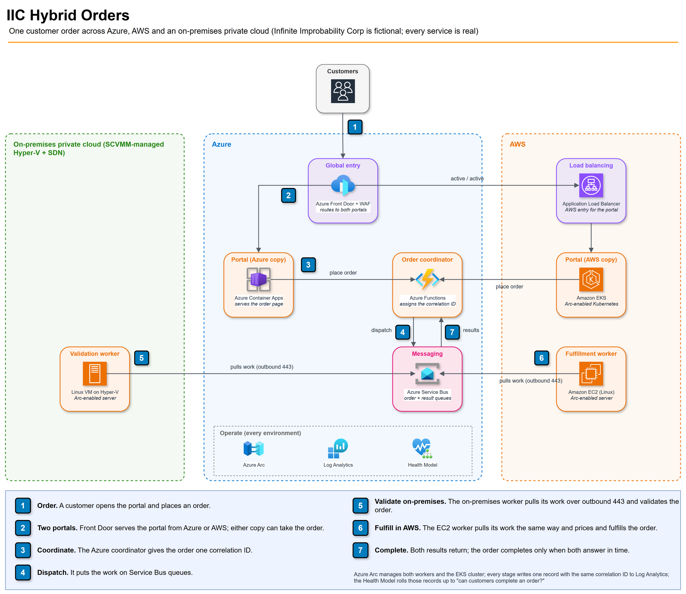
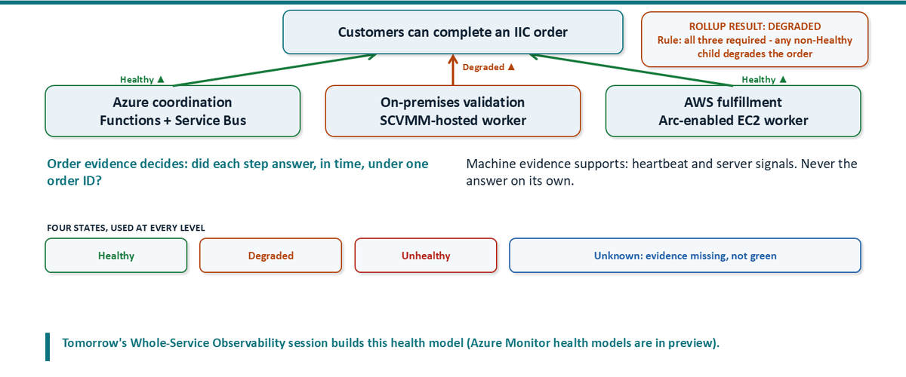
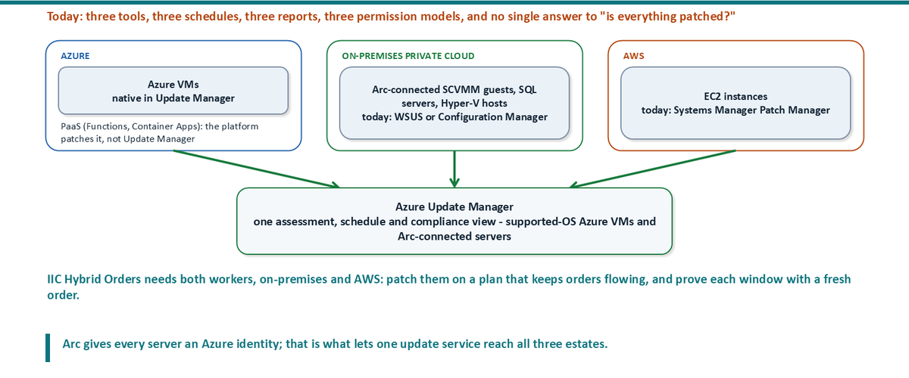
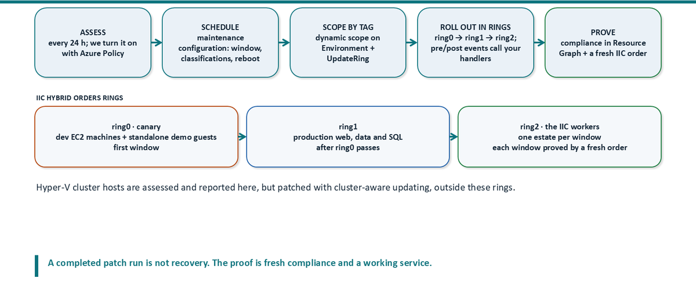
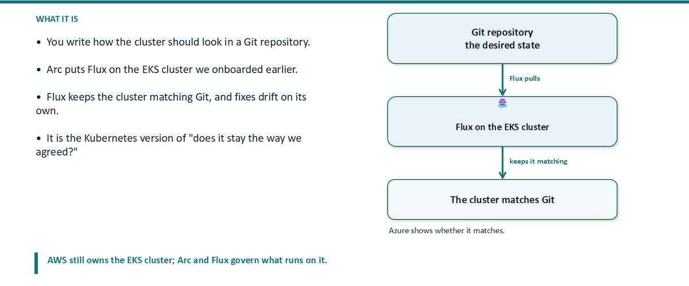
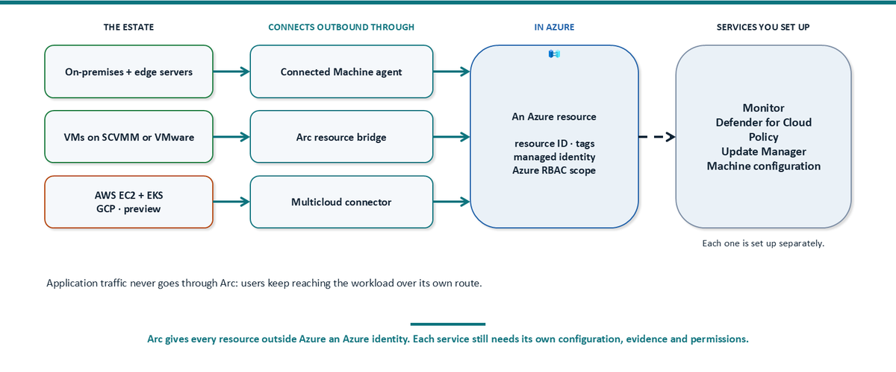
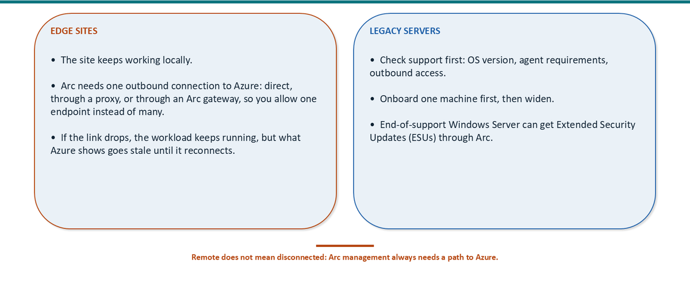

# Hybrid Operations in 2026

## Session companion

Kristopher Turner | CAS26 | September 2026

Your workloads run in Azure, in your own datacenter, in at least one other cloud, at edge sites and on older systems, and they will stay there. Each place has its own tools, owners, access model and bill. Hybrid operations is the work of running them as one estate: the same owners, the same evidence, the same access rules and the same response, wherever each piece runs. Azure Arc gives resources outside Azure an Azure identity, so Azure's monitoring, security, governance and management services can reach them. The operating model is what you add: who owns what, which evidence counts, who may act, what it costs, and how you prove a fix worked.

This companion is written for anyone who wants to apply the session, whether or not they were in the room, and it assumes you have no lab of your own yet. The session had two halves. The first made the estate **manageable**: servers, VMs, AWS servers and a Kubernetes cluster connected to Azure through Azure Arc, so they can be seen and managed in one place; that part is summarized in Appendix A. The second, and the body of this companion, is about **operating** the service that runs on that estate: keeping it working, protected, governed, affordable and getting better. Managing the estate is not the same as running the service.

Each main section opens with its question and a plain answer, then the detail with diagrams from the session, a check you can run in your own tenant with what the result means, the decision you are left with, and current Microsoft Learn references. Keep the two-page **desk playbook** next to it for daily decisions.

### Why hybrid needs an operating model

Your workloads live in several places, and each place is run differently. Ask four questions about each place and you get five different answers:

| | Azure | Your datacenter | Other clouds (AWS here) | Edge sites | Older systems |
|---|---|---|---|---|---|
| **Which team owns it?** | Cloud team | Infrastructure team | Another cloud team | Site staff | Whoever still knows it |
| **Is it working, and where do you look?** | Azure Monitor | SCOM, VMM, vCenter | CloudWatch | Local tools over weak links | Old agents or none |
| **Who is allowed to change it?** | Azure RBAC | AD groups and hypervisor roles | AWS IAM | Local admin accounts | A legacy admin model |
| **What does it cost?** | Azure invoice | Hardware, licences and power | AWS invoice | Site budget | Extended support |

One service can touch all five places. Read one row across and you see why nobody can answer the question for the whole service; read one column down and you see how differently each place is run. The session closes these gaps one question at a time: ownership in **Govern**, where to look in **Observe**, who may change it in **Secure**, the bill in **Cost**, and a fifth section, **Adopt**, that asks whether a fix actually worked.

### Five questions to take home

1. **Observe:** Is it working, and where do you look?
2. **Secure:** Who is allowed to change it, and how is it protected?
3. **Govern:** Which team owns it, and does it stay the way we agreed?
4. **Cost:** What does it cost, and how do we keep it in check?
5. **Adopt the patterns:** Did the fix work, and what do we keep doing?

### How to read the examples

Every example uses one application, IIC Hybrid Orders, which runs across Azure, AWS and an on-premises private cloud. The next pages describe it. Commands use placeholders in capitals, such as `YOUR_RG`; replace them with verified values. No output in this document is a result from your environment. Preview features are marked; check their current status before you rely on them.

<!-- pagebreak -->

## The example application: IIC Hybrid Orders

Every example in this session uses one application, so you can see each operating decision applied to the same thing. The company, Infinite Improbability Corp, is fictional (the name is a nod to *The Hitchhiker's Guide to the Galaxy*). The services are real, and the pattern is common: one customer outcome that depends on Azure, AWS and an on-premises private cloud at the same time.



### How one order flows

1. A customer opens the order portal and places an order.
2. Azure Front Door serves the portal from either of two copies: one on Azure Container Apps, one on Amazon EKS behind an Application Load Balancer. Either copy can take the order.
3. An order coordinator on Azure Functions gives the order a correlation ID. Every later record about this order carries that ID.
4. The coordinator puts the work on Azure Service Bus queues.
5. A validation worker on a Linux VM in the on-premises private cloud (SCVMM-managed Hyper-V) pulls its work and validates the order against a private enterprise system.
6. A fulfillment worker on Amazon EC2 pulls its work and prices and fulfills the order.
7. Both results come back through Service Bus. The order is complete only when both workers answer within the time target.

### What runs where, and what an operator owns

| Environment | Component | How Azure sees it | The operator decides |
|---|---|---|---|
| Azure | Front Door + WAF, Container Apps portal | Native Azure resources | Routing, failover between the two portals, WAF policy |
| Azure | Functions coordinator, Service Bus | Native Azure resources | Timeouts, queue limits, dead-letter handling, who may send and receive |
| On-premises | Validation worker (Linux VM on Hyper-V, managed by SCVMM) | One Azure Arc machine resource (kind SCVMM) with guest management | Guest patching and access, VM placement, the network path out |
| AWS | Portal copy on EKS behind an ALB | Arc-enabled Kubernetes cluster (onboarded by the multicloud connector, preview) | Cluster lifecycle in AWS; what runs on it, kept in line by GitOps from Azure |
| AWS | Fulfillment worker on EC2 | Arc-enabled server (onboarded by the multicloud connector) | Instance lifecycle in AWS; guest configuration, patching and security from Azure |

The workloads stay where they run. Azure Arc gives the servers and the cluster an Azure identity, so the same monitoring, access, security, Policy and cost practices apply to all of them. If any of this onboarding vocabulary is new, read Appendix A first.

### Design decisions worth copying

- **Workers pull; nothing is published inbound.** Both workers open outbound HTTPS (443) connections to Service Bus. There is no VPN between AWS and the datacenter, and no inbound firewall rule to either worker.
- **Machines sign in as themselves.** Each worker authenticates to Service Bus with its Arc-enabled server's managed identity. It holds only the receive role on its own queue and the send role on the results queue. There is no connection string or shared key to leak or rotate.
- **One correlation ID, one record per stage.** Every stage in every environment writes a record with the same ID, the stage, the result and the duration. One query can then show exactly which environment was slow or failed.
- **Redundancy and dependency are stated, not assumed.** Losing one portal copy makes the service Degraded; losing both makes it Unhealthy. Either worker failing fails the order, because both are required.
- **Faults are rehearsed on purpose.** Test faults slow down or fail one worker for tagged test orders only, never stop a host, and always end with a fresh order that proves recovery.

### The five questions, asked of this application

| Question | For IIC Hybrid Orders | Evidence that answers it |
|---|---|---|
| Observe: is it working, and where do you look? | Did a new order complete, and how long did each stage take? | Stage records by correlation ID; machine heartbeats only support the answer |
| Secure: who is allowed to change it, and how is it protected? | Who holds the keys to the coordinator, the queues, each worker and the cluster, and are the workers covered by Defender for Cloud? | Azure RBAC, hypervisor and AWS roles, each worker identity's two roles, Defender coverage and findings |
| Govern: which team owns it, and does it stay the way we agreed? | Are the Arc resources placed, tagged, compliant with Policy, patched, and is the EKS cluster still what Git says? | Placement and tags, Policy compliance, Update Manager results, Flux compliance state |
| Cost: what does it cost, and how do we keep it in check? | Front Door, Functions, Service Bus, monitoring and Arc services in Azure, plus the VM, EC2 and EKS costs outside Azure | Azure cost by tag, licence benefits, source-platform costs, people's time |
| Adopt: did the fix work, and what do we keep doing? | After any change, made by a person or by the system, does a new order complete in time? | A fresh order after every change |

The full design, including the telemetry fields and the health model, is `lab/design/HYBRID-APPLICATION-HEALTH-DESIGN.md` in the session repository. The companion Whole-Service Observability session builds the Azure Monitor Health Model for this application and investigates a failure in one cloud.

<!-- pagebreak -->

## 1. Observe: is it working, and where do you look?

**The plain answer.** Look in one place, Azure Monitor, and judge the service by whether a real order completes, not by whether the servers look healthy. A server's data only arrives when a rule tells its agent what to collect, and green servers can sit under a broken service. So this section follows the data in, shows why server checks are not enough, and builds a view of the whole service.

### One place to look: Azure Monitor

Azure Monitor is where you look across the estate. Its data comes from three kinds of source: **servers**, where the Azure Monitor agent sends logs and performance counters; **Azure services** (Front Door, Functions, Service Bus), which report their own metrics without an agent; and **the application**, which reports each step of an order through Application Insights. The data is stored as logs (Log Analytics) and metrics, and it is used for dashboards and alerts, health models, and security analytics in Microsoft Sentinel. Each of those uses needs its own setup; collecting data does not switch any of them on.

### How a server's data gets in: agent + DCR


Installing the Azure Monitor agent collects nothing on its own. A **data collection rule (DCR)** tells it what to collect (which events, Syslog or performance counters) and where to send it, and a **DCR association** assigns that rule to a particular server, which configures the agent there. These are the names you will see in the portal, under **Monitor > Data collection rules**. **Agent + DCR = data. No DCR, no data.** Logs and counters go to a Log Analytics workspace; guest OpenTelemetry metrics can go to an Azure Monitor workspace (preview). For Kubernetes clusters, the metrics path is Azure Monitor managed service for Prometheus. When a chart is empty, the DCR and its association are the first thing to check, then the destination and the query time window.

**Verify in your tenant.** Confirm the machine has an association, then that data arrives:

```powershell
az monitor data-collection rule association list `
  --resource YOUR_ARC_MACHINE_RESOURCE_ID -o table
```

*Expect* at least one association naming your DCR. Then run the heartbeat query in Appendix B.2. *If the association is missing,* nothing you configured is being collected, whatever the agent status says.

### Green servers, broken service


Most teams judge health by their machines: Arc says connected, the dashboard has data, so it must be fine. Customers do not use machines; they use the service. There are three separate checks, and they can disagree either way:

| Check | What it tells you | How you check it | The catch |
|---|---|---|---|
| **Arc says connected** | You can manage the server | The Arc agent status | Can be green while orders fail |
| **Data is arriving** | You can see the server and the app | Fresh logs and metrics | Can be red (monitoring broke) while orders still work |
| **Orders complete** | The service works | A fresh order, traced end to end | This is the check that proves it |

The dangerous case is the first: servers and data are green, the team says "all green", and customers cannot order. **Check the service, not just the servers.** That is why the rest of this section builds a view of the whole service.

### From signals to machine health to service health



Read service health from the outcome down. For IIC Hybrid Orders the outcome is "customers can complete an order", and it has three required branches: Azure coordination, on-premises validation on the SCVMM-hosted worker, and AWS fulfillment on the Arc-enabled EC2 worker. **Order evidence decides** (did each step answer, in time, under one order ID). **Machine evidence supports** (heartbeat and server signals, never the answer on its own). The same four states apply at every level: Healthy, Degraded, Unhealthy, and **Unknown**, which means evidence is missing, not green.

The lasting lesson from System Center Operations Manager (SCOM) is service context: components matter because they support a customer outcome. Keep that, and leave behind the habits that hurt it:

- **Alert fatigue.** Many device alerts, few that say which service is affected. Alert on the order outcome and route component alerts to component owners.
- **Duplicated collection.** The same signal gathered by two tools, paid for twice, answering nothing new. Pick one collection path per question.
- **Blind spots.** Missing data shown as healthy. A state with no fresh evidence is Unknown.

| Evidence | What it tells you | What it does not |
|---|---|---|
| Arc status Connected | The management path works | Anything about the application |
| Recent heartbeat | The agent sent data recently | That the customer path works |
| A completed order | That order succeeded | Every order, or the next one |
| Failure percentage | Failures in the sample you queried | Anything, if the sample is too small or stale |
| Health model state | What your rules conclude from their signals | More than the signals and rules allow |

An actionable alert names the likely impact, the evidence and its time, the owner, the next permitted action and the condition that proves recovery.

### Two places to ask questions

To fill that health view you need evidence, and it lives in two different places. **Resource Graph tells you what exists; Azure Monitor tells you what happened.**

| Question | Where to ask | Example | Query with |
|---|---|---|---|
| What exists and how is it set up? | Azure Resource Graph | Which servers are connected, tagged and have the agent | KQL subset |
| What happened on the server? | Log Analytics workspace | Recent events, Syslog, heartbeat, application records | KQL |
| How is a number trending? | Metrics (platform metrics, or an Azure Monitor workspace for Prometheus-compatible metrics) | CPU, queue length, response time | Metrics explorer or PromQL |
| Does an order complete now? | A fresh order traced end to end | Each step answered, and how long it took | Your stage records (Appendix B.3) |

Same query language, different data: Resource Graph holds no guest events, CPU history or request records. A practical investigation first lists the resources that should exist (Appendix B.1), then checks each one's evidence in a defined time window (B.2, B.3). A resource that exists but has no fresh evidence is an investigation gap, not a healthy result.

**Decision you make:** the customer outcome, the minimum sample and the freshness threshold that define Healthy, Degraded, Unhealthy and Unknown for your service.

References: [Azure Monitor overview](https://learn.microsoft.com/en-us/azure/azure-monitor/overview), [Data collection rules](https://learn.microsoft.com/en-us/azure/azure-monitor/data-collection/data-collection-rule-overview), [Azure Monitor agent](https://learn.microsoft.com/en-us/azure/azure-monitor/agents/azure-monitor-agent-overview), [Guest OpenTelemetry metrics (preview)](https://learn.microsoft.com/en-us/azure/azure-monitor/vm/metrics-opentelemetry-guest), [Azure Resource Graph](https://learn.microsoft.com/en-us/azure/governance/resource-graph/overview), [Health models (preview)](https://learn.microsoft.com/en-us/azure/azure-monitor/health-models/overview). The companion Whole-Service Observability session builds this health model in depth.

<!-- pagebreak -->

## 2. Secure: who is allowed to change it, and how is it protected?

**The plain answer.** Access to a hybrid server is not one permission but four separate ones, so security starts with knowing who holds which key and giving everyone the smallest key for the shortest time. Then two services watch the servers: Microsoft Defender for Cloud shows what is weak and what is under attack, and Microsoft Sentinel turns security data from servers and cloud services into incidents that someone owns.

### Four doors, four keys

A hybrid server has four separate doors, each with its own key, and a key to one door does not open the others. The doors are independent and sit side by side; they are not steps you pass through in order.

| Door | Lets you | Key |
|---|---|---|
| Azure | See or change the server in the Azure portal | An Azure role (RBAC) |
| Sign in | Log on to Windows or Linux | The server's own accounts (RDP, SSH) |
| Hosting | Stop, move or delete the VM | SCVMM or AWS admin rights |
| App + data | Use the app or read its data | The app's own permissions |

Being an Azure administrator does not let you log on to the server, and a local administrator has no rights in Azure. Arc adds the Azure door; it does not merge the doors. **The trap:** an Azure role that can use Run Command or install extensions on an Arc-enabled server can run code on it as an administrator without ever logging on. Treat those rights as administrative access to the server.

### Who holds which key: three rules for any estate

People, machines and fix-up tools each get the smallest key for the shortest time.

| Who | The rule | In IIC Hybrid Orders |
|---|---|---|
| People (admins, operators) | Read-only by default; admin rights only when asked for, for a limited time, after MFA (Privileged Identity Management) | A stolen operator login can look but not change anything |
| Machines and apps | Each gets its own identity (for example the Arc machine's managed identity), only the permissions it needs, and no stored passwords | Each worker can receive from its own Service Bus queue and post results, nothing else |
| Fix-up tools (anything that changes resources for you) | Can change one thing, in one place, and every change is logged in the Activity Log | The Policy remediation identity can change tags in one resource group only |

This is Zero Trust in practice: verify who it is, give the least access, and assume a key will be stolen.

**Take this back:** list every identity that can change a server and check it against these three rules.

**Verify in your tenant.** List everything that applies to one Arc resource, including inherited assignments:

```powershell
az role assignment list --scope YOUR_ARC_MACHINE_RESOURCE_ID `
  --include-inherited -o table
```

*Look for* broad roles inherited from the subscription or management group, and for any assignment that grants extension or Run Command rights to people who should only read. A Reader assignment here does not cancel a Contributor assignment higher up. Test access by trying the action with each identity, not by reading the assignment list alone, and check the Activity Log record afterwards.

### Defender for Cloud


Defender for Cloud shows what is weak and what is under attack, on every connected server. Read it as one chain:

1. **Turn it on:** an Arc-connected server plus the **Defender for Servers** plan.
2. **On the server:** the plan installs **Defender for Endpoint**, the sensor on the machine.
3. **What you get:** two kinds of result. **What's weak (posture):** security recommendations and vulnerability findings, which say where risk can be reduced. **What's under attack (protection):** security alerts, which say something suspicious happened.
4. **An owner decides:** fix the weakness, or respond to the attack.

**Defender for Cloud is the dashboard in Azure. Defender for Endpoint is the sensor on the server.** Fix what's weak; respond to what's under attack. A recommendation is not a security alert, and neither is a Sentinel incident.

Without the plan and the sensor there are no vulnerability findings or alerts from this path; free foundational CSPM recommendations can still appear. From October 27, 2026, free Foundational CSPM is no longer on by default for new Azure subscriptions. Check coverage before you read an empty view as good news.

**Verify in your tenant.** Check the plan, then the extensions, then the findings for one machine:

```powershell
az security pricing show -n VirtualMachines --query "{tier:pricingTier, plan:subPlan}"
az connectedmachine extension list -g YOUR_RG --machine-name YOUR_MACHINE -o table
```

Then list its assessments in Azure Resource Graph (Appendix B.4). *Expect* tier `Standard` with the plan you pay for, an `MDE.Windows` or `MDE.Linux` extension in a succeeded state, and assessments whose resource ID matches the machine exactly.

**Worked example: from recommendation to verified fix.** A recommendation says a machine is missing system updates. Confirm it applies to the exact resource and note its assessment time. Name the owner and the maintenance window. Apply the change through your update process. The assessment refreshes on its own schedule, so record the change time and confirm the recommendation reports Healthy after the next assessment. A completed patch job is not that confirmation, and dismissing a finding does not fix its underlying condition.

### Microsoft Sentinel


Microsoft Sentinel turns security data into detections and incidents. Data comes from two kinds of source:

- **Your servers:** their security events, sent through the same Azure Monitor agent and DCR described in section 1.
- **Cloud services:** Microsoft Entra ID, Azure activity, Microsoft 365 and other SaaS applications, through **data connectors**.

Everything lands in one Log Analytics workspace with Sentinel enabled. A scheduled **analytics rule** looks for trouble and, when it is set to, creates an **incident** with its entities and evidence for an owner to investigate and respond to. **No data and no rule means no incident.** Incidents are investigated in the Microsoft Defender portal; Sentinel's Azure-portal experience retires after March 31, 2027. Sentinel does not replace Defender for Cloud posture management or Azure RBAC.

**Triage checklist:** confirm the workspace and time range; read the latest state of the incident (incidents have several records over time); open its entities and evidence; identify the affected workload and its owner; decide and record the response; classify and close only when the evidence supports it. Writing a test event is not proof that it was ingested or that a rule fired; check each step.

**Decision you make:** who holds each key, who owns each class of finding and incident, and what evidence closes it.

References: [Azure RBAC overview](https://learn.microsoft.com/en-us/azure/role-based-access-control/overview), [Arc security and authorization](https://learn.microsoft.com/en-us/azure/azure-arc/servers/security-identity-authorization), [Arc extension security](https://learn.microsoft.com/en-us/azure/azure-arc/servers/security-extensions), [Privileged Identity Management](https://learn.microsoft.com/en-us/entra/id-governance/privileged-identity-management/pim-configure), [Defender for Servers](https://learn.microsoft.com/en-us/azure/defender-for-cloud/defender-for-servers-overview), [Sentinel data connectors](https://learn.microsoft.com/en-us/azure/sentinel/connect-data-sources), [Sentinel in the Defender portal](https://learn.microsoft.com/en-us/azure/sentinel/microsoft-sentinel-defender-portal), [Sentinel incident investigation](https://learn.microsoft.com/en-us/azure/sentinel/investigate-incidents).

<!-- pagebreak -->

## 3. Govern: which team owns it, and does it stay the way we agreed?

**The plain answer.** Governance is two things: who owns each resource, and whether it stays the way you agreed. A landing zone decides where each resource lives and which rules and access it inherits; Azure Policy checks those rules everywhere and can fix what drifts; a compliance standard shows the rules to an auditor; one patch process keeps every estate current; and GitOps keeps a Kubernetes cluster matching what you wrote down.

### A landing zone is the operating foundation for workloads at scale

In Microsoft's words, an **Azure landing zone** is "a proven and flexible architecture for governing, securing, and scaling a multi-subscription Azure environment." It is not a single subscription. It has two parts:

- **The platform landing zone:** the central foundation, made of the management group hierarchy plus shared services such as connectivity, identity, security monitoring and management. Most organizations should have only one per Microsoft Entra tenant.
- **Application landing zones:** one per workload. Each holds all of that workload's environments (for example development, test and production), and each environment is one or more subscriptions, placed under the Landing zones management group.

Guardrails are inherited: Azure Policy and access set on a management group apply to every subscription below it, so a rule set once at the top reaches every workload. You can build a landing zone with Microsoft's accelerators or as a custom build. Microsoft organizes the design into eight design areas: billing and tenant, identity and access, resource organization, network topology and connectivity, security, management, governance, and platform automation and DevOps. Arc resources land in an application landing zone like any other workload.

### Azure Arc landing zone


The Azure Arc landing zone accelerator for hybrid and multicloud adapts that foundation for Arc-enabled resources. Placement decides what a resource inherits: the subscription and resource group determine which Policy applies and who can see or manage it. Include the resource group the multicloud connector creates (named `AWS_<AccountId>` for AWS) in that design; do not assume every Arc resource lands in one group you chose. The accelerator does not move the workload or remove the source platform's ownership.

Its guidance for Arc-enabled servers covers identity and access, network connectivity, resource organization, governance and security, management and monitoring, cost governance, and automation (Microsoft's design-area names). One of them is easy to misread. For Arc, the **network** design area is about **how the agent reaches Azure**, decided in your datacenter and in AWS, not about Azure virtual networks:

| Path | What it means |
|---|---|
| Direct | The agent goes straight out on HTTPS (TCP 443) |
| Through your proxy or firewall | You allow Azure's endpoints; an **Azure Arc gateway** cuts the list to a handful (about seven or eight, depending on the Microsoft page) |
| Private | **Azure Private Link** over ExpressRoute or VPN; the only option that needs a private endpoint in an Azure virtual network |

### Azure Policy


Azure Policy is rules you set once and Azure checks everywhere. You write a rule once and assign it to a management group, subscription or resource group; everything under that scope inherits it, including Arc-enabled servers on-premises and in AWS. Azure checks every resource against the rule, reports which ones comply, and, depending on the rule, can block or fix the ones that do not.

If you know Group Policy, the idea is familiar (a rule assigned at a scope and inherited down), but it governs something different:

| Tool | What it controls | Where it is assigned |
|---|---|---|
| **Group Policy (GPO)** | Settings inside Windows, on domain-joined machines | Linked to an OU, inherited down |
| **Azure Policy** | The Azure resource itself: tags, location, size, whether a feature is on. It does not reach inside the operating system | Management group, subscription or resource group, inherited down |
| **Machine configuration** (formerly guest configuration) | Settings inside the operating system, Windows and Linux, on Azure VMs and Arc-enabled servers, domain-joined or not; the closest thing to a GPO | Delivered through an Azure Policy assignment |

Four real examples and what each does:

- **Require an Owner tag:** with the Modify effect, the policy adds the tag when it is missing. This is the running example below.
- **Allowed locations:** Deny blocks creating resources in the wrong region.
- **Azure Monitor agent missing:** reports machines without the agent, or installs it (DeployIfNotExists).
- **Machine configuration baselines:** check Windows password rules or TLS settings inside the server.

**Azure Policy checks the resource. Machine configuration checks inside the server.**

### How Azure Policy works


Azure Policy checks each resource against a rule, and the **effect** decides what happens next. Follow the Owner-tag policy through it:

1. **Definition or initiative:** "Require an Owner tag". An initiative groups several definitions.
2. **Assignment, parameters and scope:** assigned on the operations resource group, with a default tag value as a parameter.
3. **Evaluate resources:** a server in that group has no Owner tag.
4. **Noncompliant, with a reason:** the Owner tag is missing.
5. **Remediation task:** the Modify effect adds the tag. Remediation tasks exist only for Modify and DeployIfNotExists, and they run as the assignment's managed identity, which needs the right role.
6. **Compliant or exempt:** after the fix, a fresh check agrees.

Audit only reports, and Deny only blocks create and update requests; neither fixes a resource that already exists. **Assignment is not compliance:** you prove compliance from the evaluated resource, its reason and a fresh result.

**Enforcement mode** matters as much as the effect. In `Default` mode the effect applies on every matching create or update. Arc agents update their machine resources often, so a Modify policy in Default mode can correct a missing tag almost as soon as it appears, and nobody ever sees the resource marked noncompliant. `DoNotEnforce` keeps evaluation and still lets you run remediation tasks, without changing resources on every write; it is the recommended first stage for a Modify or DeployIfNotExists rollout. Compliance evaluation is periodic (typically about every 24 hours unless triggered sooner by a resource write or a manual scan), not instantaneous.

**Worked example: add a missing Owner tag and prove it.** An assignment in `DoNotEnforce` mode uses a Modify definition that adds `Owner` when it is absent. In the example lab this cycle ran twice with one definition and two scoped assignments: on an on-premises Arc server, then on an AWS EC2 server's Arc resource. The second assignment exists because the scope and filters that fit the on-premises machines did not reach the resource group the connector created.

```powershell
# 1. Before: the resource's tags and its compliance state
az resource show --ids YOUR_RESOURCE_ID --query tags
az policy state list --resource YOUR_RESOURCE_ID `
  --query "[].{policy:policyDefinitionName, state:complianceState, at:timestamp}" -o table

# 2. Remediate the resources already marked noncompliant (ExistingNonCompliant is the default)
az policy remediation create -n add-owner-tag -g YOUR_RG `
  --policy-assignment YOUR_ASSIGNMENT_ID --resource-discovery-mode ExistingNonCompliant
az policy remediation show -n add-owner-tag -g YOUR_RG `
  --query "{state:provisioningState, deployments:deploymentStatus}"

# 3. After: the tag exists, and a fresh evaluation agrees
az resource show --ids YOUR_RESOURCE_ID --query tags
az policy state trigger-scan -g YOUR_RG
```

*Proof* is both the changed resource and a compliance result newer than the change. Two traps: an Azure tag on an Arc resource does not change the native AWS tag, and a placeholder value can satisfy a tag rule while no one has actually accepted ownership.

**What this proves.** One definition, two scoped assignments, two real machines in two hosting locations: each noncompliant resource was identified, a bounded remediation ran, and fresh Policy evidence verified the result. The same discipline applies to every change that follows: **identity → scope → bounded action → fresh outcome.** VMs managed through SCVMM are governed the same way; they show up in Policy compliance, monitoring and Update Manager like any other Arc-enabled server.

### Compliance: prove it against a standard

A regulation or standard is a set of rules someone else agreed for you, so compliance is the second half of Govern's question (does it stay the way we agreed?) when the agreement is a regulation. **You do not need Microsoft Purview to do compliance for Azure, Arc, AWS and GCP.** Azure does it with two tools; Purview is an optional, organization-wide layer on top.

| | In Azure (what this session shows) | Organization-wide (optional) |
|---|---|---|
| Tool | **Azure Policy** writes the rules: built-in regulatory compliance initiatives, which reach Arc-enabled servers too, including settings inside the operating system through machine configuration. **Defender for Cloud** keeps the score: its regulatory compliance dashboard assesses Azure subscriptions, Arc-enabled on-premises servers, AWS accounts and GCP projects against the standards you assign. | **Microsoft Purview Compliance Manager** receives the Defender for Cloud results without extra setup, combines them with Microsoft 365, and adds improvement actions and auditor reporting. |
| Cost | The Microsoft cloud security benchmark is free. Assigning other standards needs a paid Defender for Cloud plan other than Defender for Servers Plan 1 or Defender for APIs Plan 1. | Comes with Microsoft 365 and Office 365 licences, but only the Microsoft Data Protection Baseline template is included. E5, A5 and G5 customers can choose three premium regulatory templates at no extra cost; other premium templates are bought as add-ons. |

Standards you can track include NIST SP 800-53, NIST CSF 2.0, CIS, PCI DSS 4.0, ISO 27001, SOC 2, HITRUST, NIS2 and GDPR. Be precise about what this gives you: **a compliance score is evidence for an auditor, not a certificate.** The tools track and evidence controls; they do not make you compliant or certified. Timely note: from October 27, 2026, free Foundational CSPM is no longer on by default for new Azure subscriptions, so check that the posture baseline your score depends on is actually turned on.

**Verify in your tenant.** Open **Defender for Cloud > Regulatory compliance** and check which standards are assigned to each subscription, AWS account and GCP project. A standard with no assessed resources does not appear on the dashboard at all, so an empty dashboard can mean nothing is in scope rather than nothing is wrong.

### Kept current: one patch process for every estate



Most hybrid estates patch each environment its own way: Azure virtual machines in Azure, on-premises servers with WSUS or Configuration Manager, AWS instances with Systems Manager Patch Manager. That is three tools, three schedules, three reports, three permission models, and no single answer to "is everything patched?" Because Arc gives every server an Azure identity, **Azure Update Manager** can assess, schedule and report on Azure VMs and every Arc-enabled server, Windows and Linux, from one view. Platform services such as Azure Functions and Container Apps are patched by Microsoft, not by Update Manager; clustered Hyper-V hosts can be assessed and reported here while cluster-aware updating does the patching.



| Stage | Mechanism | What to decide |
|---|---|---|
| Assess | Periodic assessment about every 24 hours, turned on at scale with the built-in Azure Policy | Which resource groups, including connector-created ones |
| Schedule | A maintenance configuration: window, duration, classifications, reboot setting | Windows per environment and workload (SQL, hosts) |
| Scope by tag | A dynamic scope selects machines by subscription, resource group, location, OS and tags, so a correctly tagged new server joins its window without editing any list | A tag schema (for example `Environment`, `UpdateRing`, `Workload`) |
| Roll out in rings | Canary first (ring0), then production in waves; pre and post events can call your own handlers around each window | Which machines are canaries; never patch every copy of a dependency in one window |
| Prove | Fresh compliance in Resource Graph, plus a working service after the window | What transaction proves each window |

For IIC Hybrid Orders both workers are required, so they are patched in separate windows, one estate at a time, and each window ends with a fresh order.

**What a working setup looks like, in four steps.** (1) One view: pending updates for Azure, on-premises and AWS machines together. (2) How machines get picked: the ring0 maintenance configuration and its tag-based dynamic scope, selecting machines from both estates. (3) Run it: patch one on-premises and one AWS canary machine in the same window. (4) Prove it: update history and a fresh assessment for each machine, then a fresh IIC order. A patch run proves the run; fresh compliance and a working service prove the outcome.

**Verify in your tenant.** Pending updates for every Arc machine, all estates in one result:

```kusto
patchassessmentresources
| where type =~ 'microsoft.hybridcompute/machines/patchassessmentresults'
| extend rg = tostring(split(id, '/')[4]), machine = tostring(split(id, '/')[8])
| project machine, rg, os = tostring(properties.osType),
    critical = toint(properties.availablePatchCountByClassification.critical),
    security = toint(properties.availablePatchCountByClassification.security),
    assessedAt = todatetime(properties.lastModifiedDateTime)
| order by critical desc, security desc
```

*Expect* one row per assessed machine with a recent `assessedAt`. A machine with no row is not assessed; check its Arc status and the periodic-assessment policy before reading the counts. What Update Manager costs, and when it is free, is in section 4.

**End-of-support servers.** Servers that cannot be upgraded yet can receive Extended Security Updates (ESUs) through Arc, billed monthly through Azure and patched through Update Manager. ESUs are licensed by core (minimum eight virtual cores per VM or sixteen physical cores per server) and need Software Assurance or an equivalent subscription.

| | Windows Server 2012 / 2012 R2 | Windows Server 2016 |
|---|---|---|
| Key date | ESUs end **October 13, 2026**, the final year; no security updates after that | Extended support ends **January 12, 2027** |
| Through Arc | Available now; late enrolment is back-billed to the start of the ESU term | Can be set up now (since August 3, 2026); billing starts January 13, 2027; up to three years |
| Illustrative cost, one hypothetical 4-vCPU Standard VM billed at the 8-core minimum | 8 × $0.00648 × 730 h ≈ **$38 a month** | 8 × $0.007132 × 730 h ≈ **$42 a month** |
| Update Manager | Included at no extra charge for ESU-enrolled servers | Included at no extra charge for ESU-enrolled servers |
| Decision | Upgrade or migrate now | Enrol only the servers you cannot upgrade in time, and plan the upgrade |

Prices are US list prices from the Azure Retail Prices API on September 26, 2026, and are illustrative; check your own agreement and the pricing calculator. ESUs are a bridge to an upgrade, not a destination.

### Kept as designed: GitOps with Flux on the EKS cluster



GitOps with Flux is the Kubernetes version of "does it stay the way we agreed?", in plain words:

1. You write how the cluster should look in a Git repository.
2. Arc puts Flux on the EKS cluster that the multicloud connector onboarded.
3. Flux keeps the cluster matching Git and fixes drift on its own. It runs in the cluster and pulls from Git; Azure does not push into the cluster.
4. Azure shows whether the cluster matches (the configuration's compliance state).

AWS still owns the EKS cluster itself, its node groups and upgrades; Arc does not turn EKS into AKS. Arc and Flux govern what runs on it. Keep each Flux configuration scoped to namespaces it owns: if a Kustomization prunes a namespace, removing the configuration can delete that namespace and everything in it.

**Worked example: prove a reconciliation.**

```powershell
az k8s-configuration flux show -g YOUR_RG -c YOUR_CLUSTER `
  -t connectedClusters -n YOUR_CONFIG --query complianceState
kubectl get configmap YOUR_CONFIGMAP -n YOUR_NAMESPACE -o yaml
```

*Expect* `Compliant`, and an object whose content matches the commit you pushed. Compliant alone says Flux applied what it pulled; the object check shows what is actually running. Change one value in Git, wait for the sync interval, and check both again.

Governance evidence (a rule was checked and applied) is not workload evidence (the workload is doing its job); check both.

**Decision you make:** where each resource lives and who owns it; how each site's agents reach Azure (direct, proxy with Arc gateway, or Private Link); which rules start in audit, which may remediate, which identity does the remediating and at what scope; which standard you measure against; which ring and window each server belongs to; and which namespaces each Flux configuration owns.

References: [What is an Azure landing zone?](https://learn.microsoft.com/en-us/azure/cloud-adoption-framework/ready/landing-zone/), [Azure Arc landing zone accelerator](https://learn.microsoft.com/en-us/azure/cloud-adoption-framework/scenarios/hybrid/enterprise-scale-landing-zone), [Network topology and connectivity for Arc-enabled servers](https://learn.microsoft.com/en-us/azure/cloud-adoption-framework/scenarios/hybrid/arc-enabled-servers/eslz-arc-servers-connectivity), [Azure Arc gateway](https://learn.microsoft.com/en-us/azure/azure-arc/servers/arc-gateway), [Private Link for Arc](https://learn.microsoft.com/en-us/azure/azure-arc/servers/private-link-security), [Azure Policy overview](https://learn.microsoft.com/en-us/azure/governance/policy/overview), [Machine configuration overview](https://learn.microsoft.com/en-us/azure/governance/machine-configuration/overview), [Remediate resources](https://learn.microsoft.com/en-us/azure/governance/policy/how-to/remediate-resources), [Enforcement mode](https://learn.microsoft.com/en-us/azure/governance/policy/concepts/assignment-structure#enforcement-mode), [Regulatory compliance standards in Defender for Cloud](https://learn.microsoft.com/en-us/azure/defender-for-cloud/concept-regulatory-compliance-standards), [Policy regulatory compliance for Arc-enabled servers](https://learn.microsoft.com/en-us/azure/azure-arc/servers/security-controls-policy), [Assign regulatory compliance standards](https://learn.microsoft.com/en-us/azure/defender-for-cloud/assign-regulatory-compliance-standards), [Compliance Manager multicloud support](https://learn.microsoft.com/en-us/purview/compliance-manager-multicloud), [Compliance Manager included regulations](https://learn.microsoft.com/en-us/purview/compliance-manager-regulations-list#included-regulations), [Update Manager overview](https://learn.microsoft.com/en-us/azure/update-manager/overview), [Dynamic scoping](https://learn.microsoft.com/en-us/azure/update-manager/dynamic-scope-overview), [Periodic assessment at scale](https://learn.microsoft.com/en-us/azure/update-manager/periodic-assessment-at-scale), [ESU overview](https://learn.microsoft.com/en-us/windows-server/get-started/extended-security-updates-overview), [ESU licensing through Arc](https://learn.microsoft.com/en-us/azure/azure-arc/servers/license-extended-security-updates), [GitOps with Flux v2](https://learn.microsoft.com/en-us/azure/azure-arc/kubernetes/conceptual-gitops-flux2), [Onboard EKS through the connector (preview)](https://learn.microsoft.com/en-us/azure/azure-arc/multicloud-connector/onboard-elastic-kubernetes-service-clusters-arc).

<!-- pagebreak -->

## 4. Cost: what does it cost, and how do we keep it in check?

**The plain answer.** Connecting resources to Arc is free; the services you turn on are not; and the Azure bill is only part of the cost of a hybrid service. Keeping it in check means seeing cost by service and owner, pulling a few deliberate levers (one of which is deciding which monitoring data you keep before you pay for it), and giving every cost an owner, inside Azure and outside it.

### What Arc costs: free, paid, and free if you already own it

Connecting to Arc is free; the services you turn on are not; and many organizations already own the licence that makes the management services free, but only once they attest it.

| Free | Paid per use | Free if you already own it |
|---|---|---|
| The Arc control plane: inventory, tags, Azure RBAC, Resource Graph, templates and extensions | Azure Monitor (data ingested and retained) | Windows Server with Software Assurance, or pay-as-you-go through Arc: Update Manager, Change Tracking and Inventory, machine configuration and Windows Admin Center at no extra cost (log ingestion is still billed) |
| VM operations for Arc-enabled SCVMM and VMware vSphere | Defender for Servers (per server) | ESU-enrolled servers get Update Manager free |
| | Microsoft Sentinel (data) | Defender for Servers Plan 2 includes Update Manager |
| | Update Manager (per Arc server per month, prorated daily; see the Azure Update Manager pricing page; free for Azure VMs) | |
| | Machine configuration, change tracking, Extended Security Updates | |

**Take-home:** attest your Software Assurance. The discount does not apply until you do.

### See it and control it

**See it.** Microsoft Cost Management shows Microsoft cloud spend. Put tags on every resource, enforced by Azure Policy, so cost rolls up by service and owner. Set budgets and anomaly alerts so you are warned early. AWS and on-premises bills come from their own tools; join them to Azure cost with the same tags, for example using FOCUS-format exports.

**Control it: five levers.**

| Lever | What it means |
|---|---|
| Telemetry | Collect only what answers an operating question; choose retention and log table plans deliberately |
| Licensing | Software Assurance attestation, Azure Hybrid Benefit, pay-as-you-go through Arc |
| Commitments | Reservations and savings plans for the Azure parts |
| Right-size and clean up | Act on Azure Advisor recommendations; remove what nobody uses |
| Guardrails | Policy that requires tags and blocks expensive choices |

You cannot control what you cannot see. **Tag first.**

### Log transformations: decide what you keep before you pay for it


This is the telemetry lever in practice. Section 1 showed that the DCR decides what a server's agent collects; it can also decide what is **kept**. A **transformation** is a small KQL query inside the DCR that runs on every incoming record before it is stored in the Log Analytics workspace. You pay ingestion for what is stored, so filtering out rows and dropping unused columns lowers the bill. Two examples from Microsoft Learn:

```kusto
source | where severity == "Critical"   // keep only the rows you need
source | project-away RawData           // drop a column nobody queries
```

Transformations can also mask or remove sensitive data before it is stored. **Multi-stage transformations** (preview) go one step further: the filtering can run on the Azure Monitor agent itself, so the dropped data never leaves the server.

**The catch.** For Analytics and Basic tables, the transformation itself is normally free, but if it drops more than half of the incoming data, the part dropped beyond 50% is billed as data processing. Microsoft Learn's example:

| Incoming | Dropped by the transformation | Billed as ingestion | Billed as processing |
|---|---|---|---|
| 20 GB | 12 GB | 8 GB | 2 GB (12 GB dropped minus half of 20 GB) |
| 20 GB | 8 GB | 12 GB | 0 GB |

If Microsoft Sentinel is enabled on the workspace, there is no processing charge for transformations into **Analytics** tables, however much they drop (Basic tables still pay it). Auxiliary tables are billed differently: processing applies to all incoming data. Where you can, collect less at the source (a narrower DCR) rather than collecting everything and filtering it out.

**Table plans** are the second half of the lever. Each table in the workspace has a plan:

| Plan | Use it for | Trade-off |
|---|---|---|
| Analytics | Data you alert on, investigate and query often | Full features, highest ingestion price |
| Basic | Troubleshooting data you query now and then | Lower ingestion price; you pay per query and features are reduced |
| Auxiliary | Low-touch data such as audit logs | Lowest ingestion price; slower queries, also paid per query |

**Verify in your tenant.** Run the ingestion-by-table query in Appendix B.6 and look for large tables no one queries. Then check whether their DCR already has a transformation:

```powershell
az monitor data-collection rule show -n YOUR_DCR -g YOUR_RG `
  --query "dataFlows[].{streams:streams, transform:transformKql}"
```

*Expect* a `transform` value on the flows you meant to filter; an empty value means everything collected is stored. Before you drop anything, confirm that no alert, investigation or Sentinel detection needs it, and have an owner accept the blind spot. Fewer gigabytes lower ingestion, but the bill also depends on retention, queries and any commitment tier.

### The full cost of a hybrid service

The Azure bill is one column. On-premises infrastructure, AWS, licences and people's time are the others. Give every cost category an owner and an allocation rule.

| Part | Record |
|---|---|
| Enabled capabilities and entitlements | Service, plan, licence or benefit conditions, accountable owner |
| Azure usage and allocation | Ingestion, retention, queries, alerts, allocation by tag |
| Infrastructure outside Azure | On-premises capacity, AWS and GCP resources, data transfer, support |
| People and operating effort | People's time, tools, maintenance, incident response, training |

A workload on SCVMM or AWS keeps costing money there even when Azure manages it. Tags organize allocation but do not divide every shared bill; state the allocation method and its limits. The review should end in a decision for each capability: keep, tune, replace or retire it.

**Decision you make:** the tag schema and who enforces it, which licences to attest, the budget per service, which data each table keeps and on which plan, and who owns each cost category.

References: [Azure Arc pricing](https://learn.microsoft.com/en-us/azure/azure-arc/overview#pricing), [Windows Server Management enabled by Azure Arc](https://learn.microsoft.com/en-us/azure/azure-arc/servers/windows-server-management-overview), [Update Manager pricing FAQ](https://learn.microsoft.com/en-us/azure/update-manager/update-manager-faq#pricing), [Cost Management overview](https://learn.microsoft.com/en-us/azure/cost-management-billing/costs/overview-cost-management), [Understand cost scopes](https://learn.microsoft.com/en-us/azure/cost-management-billing/costs/understand-work-scopes), [Transformations in Azure Monitor (cost for transformations)](https://learn.microsoft.com/en-us/azure/azure-monitor/data-collection/data-collection-transformations#cost-for-transformations), [Sample transformations](https://learn.microsoft.com/en-us/azure/azure-monitor/data-collection/data-collection-transformations-samples), [Table plans](https://learn.microsoft.com/en-us/azure/azure-monitor/logs/data-platform-logs#table-plans), [Azure Monitor Logs cost calculations](https://learn.microsoft.com/en-us/azure/azure-monitor/logs/cost-logs), [Azure Monitor pricing](https://azure.microsoft.com/en-us/pricing/details/monitor/).

<!-- pagebreak -->

## 5. Adopt the patterns: did the fix work, and what do we keep doing?

**The plain answer.** A fix has worked only when the service works again, not when a task reports success. So decide how much the system may fix on its own, give every such fix an owner and a proof step, and turn what you learned into a small set of habits you repeat: the playbook, what to unlearn, and a first thirty days.

### Letting the system fix things: how much, and how you prove it

![Three levels of letting the system fix things, side by side: report only (a person reviews, nothing changes on its own, such as a Policy compliance report), fix with approval (the system proposes, a person approves, such as a Policy remediation task or an approved Update Manager ring) and fixes continuously (the system corrects drift on its own, such as Flux on the EKS cluster); all three end in one check, verify the resource and the service, with a stop-restore-escalate exit on failure and a close-and-record exit on success](assets/fig-automation-brakes.png)

Here "letting the system fix things" means fixes the system makes for you, such as Azure Policy remediation, scheduled patching with Update Manager, and Flux reconciliation. It does not mean CI/CD pipelines. There are three levels, and how much the system may fix on its own increases from left to right:

- **Report only.** A person reviews; nothing changes on its own. Example: a Policy compliance report.
- **Fix with approval.** The system proposes a fix; a person approves it. Examples: a Policy remediation task, an approved Update Manager ring.
- **Fixes continuously.** The system corrects drift on its own, with no person in each correction. Example: Flux on the EKS cluster.

Every level ends in the same check: **verify the resource and the service.** If the check fails, stop the next step, restore where possible, and escalate. If it passes, close the change (or keep watching a continuous fixer) and record the evidence.

Before you let the system fix anything, write down:

- **Owner:** who is accountable for what it changes.
- **Permissions:** the identity it acts as, and the scope it can touch.
- **Blast radius:** the most it could affect if it goes wrong.
- **When to stop:** the condition that halts the next step.
- **How you prove it:** the fresh evidence that the service works afterwards.

A task that reports success proves the task finished, not that the service recovered. For IIC Hybrid Orders, recovery means a new order completes inside the time target. The Govern section already shows two worked examples: scheduled patching with Update Manager (fix with approval: a person approves the schedule and ring plan, then each window runs in its approved scope and ends with a fresh order) and GitOps with Flux (fixes continuously, checked through its compliance state and the object in the cluster).

**Decision you make:** which one fix you hand to the system first, at which level, and how it is verified.

References: [Azure Policy remediation](https://learn.microsoft.com/en-us/azure/governance/policy/how-to/remediate-resources), [Update Manager scheduled patching](https://learn.microsoft.com/en-us/azure/update-manager/scheduled-patching), [GitOps with Flux v2](https://learn.microsoft.com/en-us/azure/azure-arc/kubernetes/conceptual-gitops-flux2).

<!-- pagebreak -->

## 6. The playbook

### What to adopt

The whole session in one table: one practice per section, with who owns it, what to do next and what proves it.

| Section | Practice | Owner | Concrete next action | Evidence |
|---|---|---|---|---|
| Observe | One place to look; alert on the order outcome, not the machine | Service owner + monitoring team | Build one service view and one outcome alert | A fresh order shows in it |
| Secure | The three key rules for people, machines and fix-up tools, plus Defender coverage | Security lead | List every identity that can change a server and check it against the rules | Review record and coverage report |
| Govern | Landing zone placement, Policy against a compliance standard, one patch process | Governance lead + platform team | Place Arc resources in the designed scope, assign a standard, tag every server with its patch ring | Compliance dashboard and ring results |
| Cost | Tag everything, attest Software Assurance, set budgets | FinOps + service owner | Enforce tags with Policy, attest Software Assurance, create a budget per service | Cost by service and owner |
| Adopt | Let the system fix things only with a proof step | Service owner | Pick one fix to hand to the system and define how it is verified | A fresh order after every change it makes |

### What to unlearn

One trap per section, and the check that replaces it.

| Section | Assumption to unlearn | Check instead |
|---|---|---|
| Observe | A heartbeat means it works | Run a fresh order |
| Secure | Connected means secured | Check who holds which key, and Defender coverage |
| Govern | An assignment means compliance | Inspect evaluation and remediation |
| Cost | No bill means free | Find the meter, the licence benefit and the allocation |
| Adopt | A finished task means recovery | Verify the outcome |

### Your first thirty days

- **Week 1:** inventory and owners (Govern). Pick one service; list its resources and dependencies and name an owner for each.
- **Week 2:** access and the key rules (Secure); placement and Policy with a standard (Govern).
- **Week 3:** one service view and one alert on the outcome (Observe).
- **Week 4:** tags and budgets (Cost); one fix the system makes for you, proved by a fresh order (Adopt).

Start with one service and repeat the pattern. Expand only when another operator can repeat the checks and explain the results.

<!-- pagebreak -->

## Appendix A. Arc foundation and onboarding

**The plain question:** how does a server, VM or cluster that is not in Azure become something Azure can manage? **The plain answer:** Azure Arc gives it an Azure resource, through one outbound connection from an agent, from the platform that runs your VMs, or from a connector to your other cloud. This is the "manage it" half of the session; the five sections above are what you do once a resource is represented.



Azure Arc extends Azure management to resources running elsewhere. Each estate uses an outbound mechanism: on-premises and edge servers run the **Connected Machine agent**; VMs on SCVMM or VMware are reached through the **Arc resource bridge**; AWS (and GCP, in preview) are reached through the **multicloud connector**. Each resource becomes one Azure resource with a resource ID, tags, a managed identity and an RBAC scope. Services such as Azure Monitor, Defender for Cloud, Policy, Update Manager and machine configuration are then set up separately. The workload does not move, Arc is not migration, and application traffic never goes through Arc. A connected server with no data collection rule collects nothing, and a connected server with no Defender plan has no Defender findings.

Keep three paths apart when you design or troubleshoot. **Management** is the Azure control plane acting on the resource. **Telemetry** is data a collector sends to a store. **Application traffic** is the workload's own path; in IIC Hybrid Orders the workers pull work from Service Bus over their own outbound connection. A healthy management connection proves nothing about the other two (see "Green servers, broken service" in section 1).

### Connecting a server to Arc

One outbound connection, and it lands where your rules apply. Three things to know before you connect one:

1. **One outbound connection.** Connecting a server installs the Azure Connected Machine agent, which makes one outbound HTTPS connection to Azure on TCP 443. No inbound ports, no VPN, and the application never uses it.
2. **Where it lands sets its rules.** The server becomes an Azure resource (`Microsoft.HybridCompute/machines`) in the subscription and resource group you choose at onboarding, and that choice decides which Azure Policy and access rules it inherits. Placement is part of the design.
3. **Prove it worked.** Check both sides: `azcmagent show` on the machine reports Connected, and the same machine appears in Azure in the intended resource group.

Connecting does not switch on monitoring, Defender for Cloud, Policy or Update Manager; each is set up separately, as the main sections describe. Use an onboarding identity scoped to the target resource group, not an unrestricted administrator.

### SCVMM and vCenter

Virtual machines are created and run by a virtualization manager: **System Center Virtual Machine Manager (SCVMM)** for Hyper-V, or **VMware vCenter Server** for vSphere. It creates, starts, stops and moves VMs and knows every VM, template and network on its hosts and clusters (in the example lab, the SCVMM-managed Hyper-V cluster `hvcl-ral-t1`). That matters for Arc:

- The Connected Machine agent sees **one machine, from the inside**.
- SCVMM or vCenter sees **every VM, from underneath**, including VMs with no agent and VMs that are powered off.
- Arc can connect to SCVMM or vCenter **once**, instead of to each VM. That is the second way into Arc.

### Connect SCVMM or vCenter to Azure Arc

Arc-enabled SCVMM and Arc-enabled VMware vSphere share one design. An on-premises **Arc resource bridge** (an appliance VM with the SCVMM or VMware extension, connecting outbound to Azure) links the management server to Azure, and a **custom location** in your subscription represents that platform. Two lanes run through it:

- **Requests**, Azure to the platform: create, start, stop, resize, or enable guest management, carried out by SCVMM or vCenter.
- **Inventory**, the platform to Azure: the bridge discovers VMs, clouds or clusters, templates and networks, and you enable the ones Azure should manage.

Enabling guest management installs the Connected Machine agent in a running VM, which is where the two ways in meet. VMware works the same way through vCenter; VMware Cloud Director tenant access is not the vCenter access this integration needs. Installing the agent on the SCVMM server itself connects only that server, not the VMs it manages.

**Arc-enabled SCVMM is retiring.** New onboarding stops in October 2026 and the service retires in September 2029. If you use it only for Azure management services (monitoring, security, Policy, updates, licensing), move to Arc-enabled servers. If you use Azure for VM lifecycle operations, Microsoft's guidance is to contact them. Arc-enabled VMware vSphere is not affected.

### Two ways to bring a VM into Arc


| | Inside the VM: the agent | From the platform: Arc-enabled SCVMM or VMware vSphere |
|---|---|---|
| What connects | The Connected Machine agent in a supported guest | SCVMM or vCenter, once, through the resource bridge |
| What you get | Guest services: monitor, secure, patch | VM operations: start, stop, create; sees every VM |
| Result | An Arc-enabled server | Arc VMs in Azure, one per enabled VM |

Use both and each VM is still one Azure resource (`Microsoft.HybridCompute/machines`, of kind SCVMM or VMware).

### The multicloud connector

The multicloud connector is one Azure resource, given read access to your AWS account or GCP project. It costs nothing, re-scans on a schedule, and the services you use with it are billed normally. It can do three things for you: show your AWS and GCP resources in Azure (**Inventory**), onboard EC2 instances and GCP VMs to Arc, and onboard EKS clusters (preview). AWS support is generally available; GCP support is in preview.


How it works, in four steps:

1. **Give Azure access.** In AWS, a CloudFormation template the portal generates creates a role Azure can use. For GCP (preview), a Terraform script does the same.
2. **The connector.** An Azure resource that uses that access.
3. **It brings things in.** A read-only list of what is there (Inventory); the Arc agent on EC2 servers, installed through AWS Systems Manager (GCP VMs through OS Config, preview); the Arc Kubernetes agents on EKS clusters (preview).
4. **You manage them, each set up separately.** Servers get Policy, Monitor and Update Manager; EKS gets Flux and Policy.

**Listed in Azure is not managed.** Inventory is only a list; onboarding puts an agent on the server or cluster; managing it is a separate step for each service. Onboarded resources land in a resource group named `<PublicCloud>_<AccountId>`, such as `AWS_123456789012`, which inherits permissions from its subscription. Put that resource group into your RBAC, Policy, Defender and cost design deliberately.

| | AWS | GCP (preview) |
|---|---|---|
| Access is granted by | A CloudFormation template the portal generates, deployed in the AWS account | A Terraform template the portal generates, run in the GCP project (for example from Cloud Shell) |
| Server onboarding uses | AWS Systems Manager (SSM agent and an instance IAM role) | GCP VM Manager (OS Config agent); an active OS Config agent has a GCP cost |
| Permissions needed | EC2 read and write for server onboarding; EKS read and write for clusters | OSPolicyAssignment Admin for server onboarding |

### Onboarding EC2 and EKS

Each becomes a different kind of Arc resource:

| | EC2 server | EKS cluster (preview) |
|---|---|---|
| The connector installs | The Connected Machine agent, through AWS Systems Manager | The Arc Kubernetes agents |
| It becomes | An Arc-enabled server (`Microsoft.HybridCompute/machines`) | An Arc-enabled Kubernetes cluster (`Microsoft.Kubernetes/connectedClusters`) |
| Then you add | Policy, Monitor, Defender, Update Manager | Flux, Policy, supported Kubernetes services |

Arc does not turn EC2 into an Azure VM or EKS into AKS, and AWS keeps the lifecycle. Keep the source ID next to the Azure ID (EC2 instance ID and Arc resource ID; EKS cluster ARN and connected-cluster ID) so later management evidence is tied to the right resource. Discovery is not onboarding, and onboarding is not management: an inventory entry means the connector can see the resource; an Arc resource means the agent is installed and connected; management means a service you configured has acted on it and you verified the result.

### Edge sites and legacy servers



**Edge: remote does not mean disconnected.** The site keeps working locally, but Arc needs one outbound connection to Azure: direct, through a proxy, or through an Arc gateway, so you allow a few endpoints instead of many. If the link drops the workload keeps running, but what Azure shows goes stale until it reconnects. Show stale evidence as Unknown, not green, and decide in advance what the local operator can do alone. Arc is not a disconnected management product.

**Legacy: check support first.** Check the operating system version, agent requirements and outbound access before you promise anything, and onboard one machine before a whole group. If a guest cannot run the agent, you may still see and operate the VM through the SCVMM or VMware integration, without guest services. End-of-support Windows Server can get Extended Security Updates through Arc (dates and costs are in section 3).

### One pattern, four onboarding paths

The pattern is the same everywhere: an agent goes in, an Azure resource comes out. What differs is who installs the agent and which resource type you get.

| Source | Who installs the agent | Azure resource type |
|---|---|---|
| On-premises or edge server | You install the Connected Machine agent | `Microsoft.HybridCompute/machines` |
| AWS EC2 | The multicloud connector, through AWS Systems Manager | `Microsoft.HybridCompute/machines` |
| GCP VM (preview) | The multicloud connector, through GCP OS Config | `Microsoft.HybridCompute/machines` |
| AWS EKS cluster (preview) | The multicloud connector installs the Arc Kubernetes agents | `Microsoft.Kubernetes/connectedClusters` |

VMs on SCVMM or vCenter can also arrive from the platform side, as described above. The connector's Inventory solution alone adds read-only records; only onboarding adds an Arc resource that can be managed.

**Verify in your tenant.** `az connectedmachine show -g YOUR_RG -n YOUR_MACHINE --query "{status:status, agent:agentVersion, changed:lastStatusChange}"` compares one machine's local and Azure state; `azcmagent check` on the machine runs its own connectivity check and names the exact endpoint to fix if one fails. Appendix B.1 lists every Arc resource in a scope.

**Decision you make:** which resource group, tags and owners each Arc resource gets at onboarding, because everything later inherits from that scope; and for each remote or legacy site, which evidence can go stale and who acts locally when it does.

References: [Azure Arc overview](https://learn.microsoft.com/en-us/azure/azure-arc/overview), [Arc-enabled servers overview](https://learn.microsoft.com/en-us/azure/azure-arc/servers/overview), [Connected Machine agent](https://learn.microsoft.com/en-us/azure/azure-arc/servers/agent-overview), [Arc network requirements](https://learn.microsoft.com/en-us/azure/azure-arc/servers/network-requirements), [Arc resource bridge](https://learn.microsoft.com/en-us/azure/azure-arc/resource-bridge/overview), [Arc-enabled SCVMM](https://learn.microsoft.com/en-us/azure/azure-arc/system-center-virtual-machine-manager/overview), [Arc-enabled SCVMM retirement and transition](https://learn.microsoft.com/en-us/azure/azure-arc/system-center-virtual-machine-manager/transition-guidance), [Arc-enabled VMware vSphere](https://learn.microsoft.com/en-us/azure/azure-arc/vmware-vsphere/overview), [Multicloud connector overview](https://learn.microsoft.com/en-us/azure/azure-arc/multicloud-connector/overview), [Add a public cloud](https://learn.microsoft.com/en-us/azure/azure-arc/multicloud-connector/add-public-cloud), [ESUs enabled by Azure Arc](https://learn.microsoft.com/en-us/azure/azure-arc/servers/deliver-extended-security-updates).

<!-- pagebreak -->

## Appendix B. Query patterns

These read-only queries teach how to interpret evidence. Replace capitals with verified values, and choose a time window that fits your service.

### B.1 Which Arc resources are in my scope? (Azure Resource Graph)

```kusto
Resources
| where type in~ ('microsoft.hybridcompute/machines',
    'microsoft.kubernetes/connectedclusters')
| where resourceGroup in~ ('YOUR_OPS_RG', 'YOUR_CONNECTOR_RG')
| project name, type, resourceGroup,
    Owner=tostring(tags.Owner),
    ServerStatus=tostring(properties.status),
    ClusterStatus=tostring(properties.connectivityStatus)
| order by resourceGroup asc, name asc
```

A blank Owner is an investigation item. Connection status does not prove collection, protection or customer success. Resource Graph is indexed and can lag a few minutes behind changes.

### B.2 When did this machine last send a heartbeat? (Log Analytics)

```kusto
Heartbeat
| where TimeGenerated > ago(30m)
| where _ResourceId =~ 'YOUR_ARC_MACHINE_RESOURCE_ID'
| summarize LastSeen=max(TimeGenerated), Samples=count() by Computer
| extend EvidenceAge=now()-LastSeen
```

No row means no matching evidence in this workspace and window. It does not prove the machine is off; check the agent, the association and the destination first.

### B.3 Are transactions completing across every environment? (Log Analytics)

This pattern needs your application to write one record per stage with a shared correlation ID. The example uses the IIC Hybrid Orders fields: TimeGenerated, CorrelationId, Component, Stage, Success (boolean) and DurationMs. Map your own table and fields first.

```kusto
YOUR_STAGE_TABLE_CL
| where TimeGenerated > ago(30m)
| summarize Completed=countif(Component == 'Coordinator'
        and Stage == 'Completed' and Success == true),
    Failed=countif(Success == false),
    SlowestStageMs=max(DurationMs),
    LastSeen=max(TimeGenerated) by CorrelationId
| extend Outcome=case(Failed > 0, 'Failed',
    Completed > 0, 'Completed', 'Unresolved')
| summarize Orders=count(),
    FailedOrders=countif(Outcome == 'Failed'),
    Unresolved=countif(Outcome == 'Unresolved'),
    LastSeen=max(LastSeen)
| extend FailurePercent=iff(Orders > 0, 100.0*FailedOrders/Orders, real(null)),
    EvidenceAge=now()-LastSeen
```

Summarizing by correlation ID first counts an order once even when it touches three environments. Any failed stage fails the order. Unresolved orders are still running or missing evidence. Zero orders is insufficient evidence, not 0% failure.

### B.4 What does Defender for Cloud say about this machine? (Azure Resource Graph)

```kusto
securityresources
| where type == 'microsoft.security/assessments'
| where tostring(properties.resourceDetails.Id) =~ 'YOUR_ARC_MACHINE_RESOURCE_ID'
| project Recommendation=tostring(properties.displayName),
    Status=tostring(properties.status.code),
    Severity=tostring(properties.metadata.severity)
| order by Status asc
```

`Unhealthy` rows are open recommendations. No rows at all usually means no coverage, not no risk.

### B.5 What is the latest state of an incident? (Sentinel workspace)

```kusto
SecurityIncident
| where TimeGenerated > ago(24h)
| summarize arg_max(TimeGenerated, *) by IncidentName
| where Title startswith 'YOUR_INCIDENT_TITLE_PREFIX'
| project IncidentNumber, Title, Severity, Status, Owner,
    CreatedTime, LastModifiedTime
```

Incidents have several records over time; `arg_max` takes the latest before you read its status.

### B.6 Which tables drive billable ingestion? (Log Analytics)

```kusto
Usage
| where TimeGenerated > ago(30d)
| where IsBillable == true
| summarize BillableGB=sum(Quantity)/1024 by DataType
| order by BillableGB desc
```

This is workspace ingestion, not an invoice. Compare equivalent periods before and after a change.

### B.7 Which Prometheus targets stopped reporting? (Azure Monitor workspace, PromQL)

```promql
avg_over_time(up[10m]) < 1
```

The metrics store uses PromQL, not KQL; the queries above cannot be pasted there. Series names depend on what you collect.

## Appendix C. Service operating contract

Complete one per service and keep it with the service's operating documentation.

| Item | Record |
|---|---|
| Service and review date | |
| Primary and backup owner | |
| Customer success test | |
| Native resource IDs and Azure IDs, recorded where | |
| Management and guest access boundaries | |
| Telemetry stores, queries and retention | |
| Freshness threshold and missing-data response | |
| Security finding and incident owner | |
| Effective Policy and exceptions | |
| Approved action, acting identity and target | |
| Stop, rollback and escalation | |
| Recovery evidence | |
| Cost source and allocation owner | |

## Appendix D. Glossary

| Term | Meaning |
|---|---|
| Arc-enabled server | A machine outside Azure running the Connected Machine agent, represented as `Microsoft.HybridCompute/machines` |
| Connected cluster | A Kubernetes cluster running the Arc agents, represented as `Microsoft.Kubernetes/connectedClusters` |
| Arc resource bridge | An appliance that connects a virtualization platform (SCVMM, vCenter) to Azure |
| Custom location | The Azure target that represents that platform for VM lifecycle operations |
| Multicloud connector | The Azure resource that connects one AWS account or GCP project; creates the `<PublicCloud>_<AccountId>` resource group |
| DCR / DCR association | Data collection rule (what to collect and where to send it) and the association that assigns it to a machine; shown in the portal under Data collection rules |
| Transformation | A KQL query inside a DCR that filters, trims or masks each record before it is stored |
| Table plan | Per-table choice of Analytics, Basic or Auxiliary, trading features and query cost against ingestion price |
| Arc gateway | An Azure resource that cuts the endpoints an Arc agent's proxy or firewall must allow to a handful |
| Log Analytics workspace | The log store, queried with KQL |
| Azure Monitor workspace | The metrics store for Prometheus-compatible data, queried with PromQL |
| Remediation task | The Policy job that applies a Modify or DeployIfNotExists effect to existing resources |
| Flux configuration | A GitOps configuration that reconciles a Git source into scoped Kubernetes namespaces |
| Landing zone | "A proven and flexible architecture for governing, securing, and scaling a multi-subscription Azure environment": one platform landing zone (usually one per Entra tenant) plus one application landing zone per workload |
| Enforcement mode | `Default` applies a Policy effect on every create or update; `DoNotEnforce` evaluates only, while remediation tasks can still run |
| PIM | Privileged Identity Management: admin rights activated on request, for a limited time, after MFA |
| Azure Policy | Rules assigned at a management group, subscription or resource group that check (and can block or fix) properties of Azure resources, not settings inside the OS |
| Machine configuration | Formerly guest configuration: audits or sets settings inside a Windows or Linux server's operating system, on Azure VMs and Arc-enabled servers, assigned through Azure Policy; the closest thing to a GPO |
| Regulatory compliance | Scoring resources against a standard (for example NIST SP 800-53, CIS or PCI DSS); evidence for an auditor, not a certificate |
| Maintenance configuration | The Update Manager schedule: window, classifications and reboot setting, with a dynamic scope that picks machines by tag |
| ESU | Extended Security Updates for end-of-support Windows Server, deliverable and billed monthly through Arc |

The session repository, [github.com/thisismydemo/cas26](https://github.com/thisismydemo/cas26), holds the deck, attendee notes, the IIC Hybrid Orders design and the demonstration runbooks. Reviewed September 30, 2026; check current support, previews, plans and prices before implementation.
